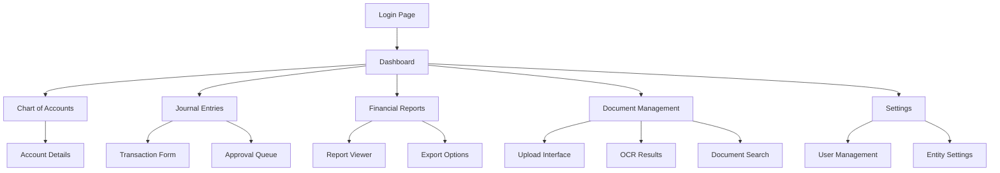

# Finance Manager - Product Requirements Document

## 1. Product Overview

Finance Manager is a modern, AI-powered corporate accounting platform that provides comprehensive financial management capabilities through a cloud-native architecture. Built on Cloudflare Workers with Astro frontend, it delivers real-time financial reporting, automated transaction processing, and intelligent document management for businesses of all sizes.

The platform solves critical accounting challenges including manual data entry, complex financial reporting, and document management inefficiencies. Target users include small to medium businesses, accounting professionals, and financial managers who need reliable, scalable accounting solutions with modern AI capabilities.

## 2. Core Features

### 2.1 User Roles

| Role | Registration Method | Core Permissions |
|------|---------------------|------------------|
| Admin User | Email invitation with magic link | Full system access, user management, entity configuration |
| Accountant | Email registration with admin approval | Transaction management, report generation, journal entries |
| Manager | Email registration with role assignment | Read-only access to reports, dashboard viewing |
| Auditor | Temporary access via secure link | Read-only access to audit trails and historical data |

### 2.2 Feature Module

Our Finance Manager consists of the following main pages:

1. **Dashboard**: Financial overview widgets, key performance indicators, recent transactions summary, quick action buttons
2. **Chart of Accounts**: Hierarchical account management, account creation and editing, balance viewing
3. **Journal Entries**: Transaction creation, double-entry validation, batch processing, approval workflows
4. **Financial Reports**: Balance sheet generation, profit & loss statements, cash flow reports, custom report builder
5. **Document Management**: Receipt upload, AI-powered OCR processing, document categorization, search functionality
6. **Settings**: User management, entity configuration, system preferences, integration settings

### 2.3 Page Details

| Page Name | Module Name | Feature description |
|-----------|-------------|---------------------|
| Dashboard | Overview Widget | Display real-time financial metrics, account balances, and recent activity summaries |
| Dashboard | Quick Actions | Provide shortcuts for common tasks like creating transactions, uploading receipts |
| Chart of Accounts | Account Hierarchy | Manage hierarchical chart of accounts with parent-child relationships and account types |
| Chart of Accounts | Account Management | Create, edit, and deactivate accounts with proper validation and balance tracking |
| Journal Entries | Transaction Builder | Create double-entry transactions with automatic balance validation and error checking |
| Journal Entries | Batch Processing | Process multiple transactions simultaneously with validation and rollback capabilities |
| Journal Entries | Approval Workflow | Implement approval processes for transactions above specified thresholds |
| Financial Reports | Standard Reports | Generate balance sheet, P&L, cash flow statements with date range filtering |
| Financial Reports | Custom Reports | Build custom reports with flexible criteria, grouping, and formatting options |
| Financial Reports | Export Functions | Export reports in multiple formats (PDF, Excel, CSV) with professional formatting |
| Document Management | Upload Interface | Drag-and-drop file upload with progress tracking and file type validation |
| Document Management | OCR Processing | Extract text from receipts and invoices using AI-powered optical character recognition |
| Document Management | Smart Categorization | Automatically categorize expenses using AI analysis of document content |
| Document Management | Search & Filter | Search documents by content, date, amount, category with advanced filtering |
| Settings | User Management | Manage user accounts, roles, permissions, and access controls |
| Settings | Entity Configuration | Configure business entities, accounting periods, and system preferences |
| Settings | Integration Setup | Configure external integrations, API keys, and third-party connections |

## 3. Core Process

### Admin Flow
1. Admin logs in via magic link authentication
2. Configures business entity and chart of accounts
3. Invites users and assigns appropriate roles
4. Sets up accounting periods and system preferences
5. Monitors system usage and manages user access

### Accountant Flow
1. Accountant accesses dashboard to view financial overview
2. Uploads receipts and invoices to document management
3. Reviews AI-generated transaction suggestions
4. Creates or approves journal entries with double-entry validation
5. Generates financial reports for management review
6. Reconciles accounts and closes accounting periods

### Manager Flow
1. Manager views dashboard for key financial metrics
2. Accesses financial reports for business analysis
3. Reviews transaction summaries and account balances
4. Exports reports for external stakeholders

## 4. User Interface Design

### 4.1 Design Style

- **Primary Colors**: Blue (#2563eb) for primary actions, Gray (#64748b) for secondary elements
- **Secondary Colors**: Green (#059669) for success states, Red (#dc2626) for errors, Yellow (#d97706) for warnings
- **Button Style**: Rounded corners (8px), subtle shadows, hover states with color transitions
- **Font**: Inter font family, 14px base size, 16px for headings, 12px for captions
- **Layout Style**: Card-based design with clean spacing, sidebar navigation, responsive grid system
- **Icons**: Lucide React icons for consistency, 20px standard size, 16px for compact areas

### 4.2 Page Design Overview

| Page Name | Module Name | UI Elements |
|-----------|-------------|-------------|
| Dashboard | Overview Cards | Clean white cards with subtle shadows, blue accent borders, responsive grid layout |
| Dashboard | Navigation Sidebar | Collapsible sidebar with icon + text labels, active state highlighting, smooth transitions |
| Chart of Accounts | Account Tree | Hierarchical tree view with expand/collapse, indentation for levels, type-based icons |
| Chart of Accounts | Account Forms | Modal dialogs with form validation, inline error messages, auto-save functionality |
| Journal Entries | Transaction Table | Sortable data table with pagination, row selection, inline editing capabilities |
| Journal Entries | Entry Form | Multi-step form with real-time validation, balance checking, draft saving |
| Financial Reports | Report Builder | Drag-and-drop interface with filter panels, preview pane, export options |
| Financial Reports | Chart Visualization | Interactive charts using Chart.js, responsive design, hover tooltips |
| Document Management | Upload Zone | Drag-and-drop area with progress indicators, file type icons, batch operations |
| Document Management | Document Grid | Thumbnail grid view with metadata overlay, search highlighting, filter sidebar |
| Settings | Configuration Panels | Tabbed interface with form sections, toggle switches, confirmation dialogs |

### 4.3 Responsiveness

The application is designed with a desktop-first approach but includes comprehensive mobile adaptations:

- **Desktop**: Full sidebar navigation, multi-column layouts, hover interactions
- **Tablet**: Collapsible sidebar, adjusted grid layouts, touch-optimized controls
- **Mobile**: Bottom navigation, single-column layouts, swipe gestures, optimized forms
- **Touch Optimization**: Larger touch targets (44px minimum), swipe actions, pull-to-refresh
- **Accessibility**: WCAG 2.1 AA compliance, keyboard navigation, screen reader support