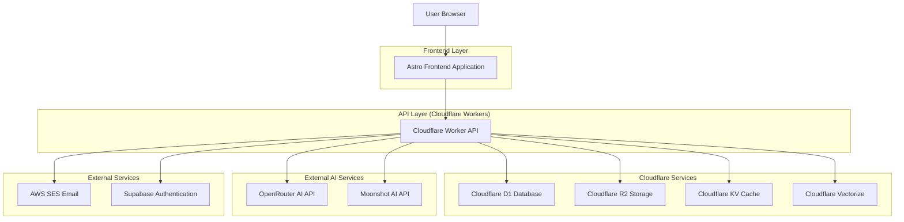
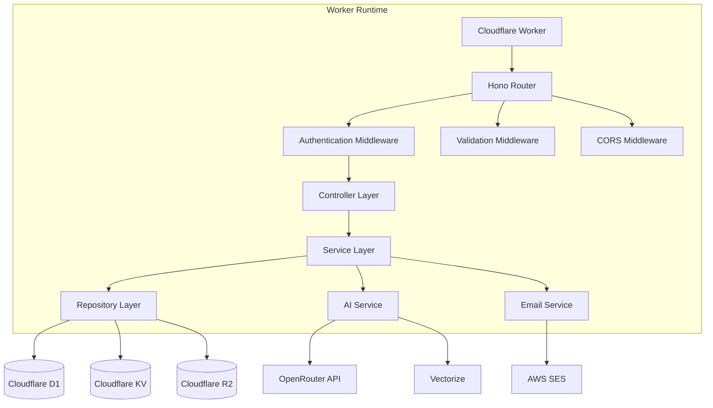
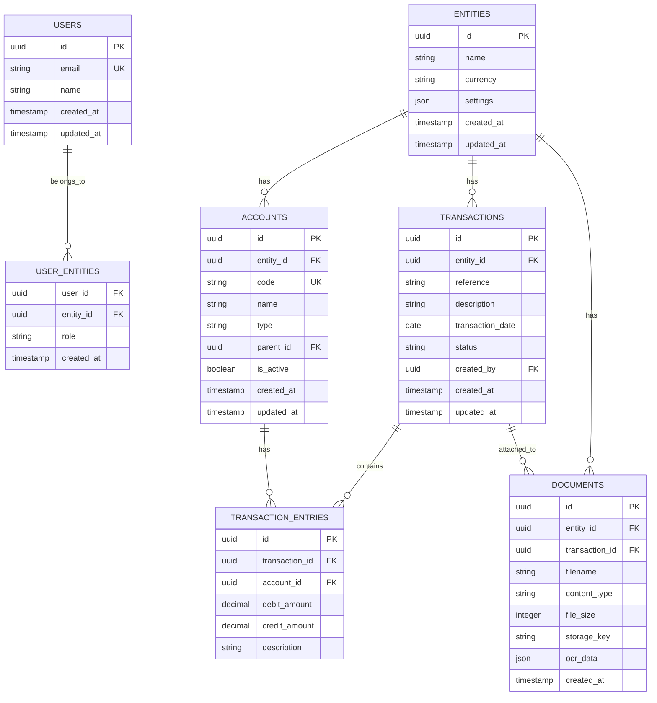

# Finance Manager - Technical Architecture Document

## 1. Architecture Design



## 2. Technology Description

- **Frontend**: Astro\@4.16 + React\@18 + TypeScript\@5.6 + Tailwind CSS\@3.4 + shadcn/ui

- **Backend**: Cloudflare Workers + Hono\@4.6 + TypeScript\@5.6

- **Database**: Cloudflare D1 (SQLite) + Drizzle ORM\@0.36 + Drizzle Kit\@0.26

- **Storage**: Cloudflare R2 (S3-compatible) + Cloudflare KV

- **AI Services**: OpenRouter API + Moonshot AI + Cloudflare Vectorize + Cloudflare AI

- **Authentication**: Supabase Auth + JWT + Magic Links

- **Email**: AWS SES

- **Testing**: Vitest\@2.1 + Playwright\@1.48 + Miniflare\@3.20 + Testing Library

- **Code Quality**: OxLint\@0.15 + Prettier\@3.3 + TypeScript ESLint\@8.8

- **Infrastructure**: Alchemy\@0.21 + Wrangler\@3.84

- **Build Tools**: Vite\@5.4 + ESBuild + pnpm\@9.12

## 3. Route Definitions

| Route          | Purpose                                                  |
| -------------- | -------------------------------------------------------- |
| /              | Landing page with authentication and overview            |
| /dashboard     | Main dashboard with financial overview and quick actions |
| /accounts      | Chart of accounts management and account details         |
| /transactions  | Journal entries, transaction creation and management     |
| /reports       | Financial reports generation and viewing                 |
| /documents     | Document upload, OCR processing, and management          |
| /settings      | User management, entity configuration, system settings   |
| /auth/login    | Magic link authentication page                           |
| /auth/callback | Authentication callback handler                          |
| /auth/logout   | User logout and session cleanup                          |
| /api/\*        | RESTful API endpoints for all backend operations         |

## 4. API Definitions

### 4.1 Core API

#### Authentication

```
POST /api/auth/magic-link
POST /api/auth/verify
POST /api/auth/refresh
POST /api/auth/logout
GET /api/auth/me
```

**Magic Link Request:**

| Param Name  | Param Type | isRequired | Description                          |
| ----------- | ---------- | ---------- | ------------------------------------ |
| email       | string     | true       | User email address for magic link    |
| redirectUrl | string     | false      | URL to redirect after authentication |

Response:

| Param Name | Param Type | Description                   |
| ---------- | ---------- | ----------------------------- |
| success    | boolean    | Authentication request status |
| message    | string     | Status message                |

Example:

```json
{
  "email": "user@company.com",
  "redirectUrl": "/dashboard"
}
```

**Token Verification:**

| Param Name | Param Type | isRequired | Description       |
| ---------- | ---------- | ---------- | ----------------- |
| token      | string     | true       | Magic link token  |
| code       | string     | true       | Verification code |

Response:

| Param Name    | Param Type | Description              |
| ------------- | ---------- | ------------------------ |
| access_token  | string     | JWT access token         |
| refresh_token | string     | JWT refresh token        |
| user          | object     | User profile information |

#### Entity Management

```
GET /api/entities
POST /api/entities
PUT /api/entities/:id
DELETE /api/entities/:id
GET /api/entities/:id/users
POST /api/entities/:id/users
```

#### Account Management

```
GET /api/accounts
POST /api/accounts
PUT /api/accounts/:id
DELETE /api/accounts/:id
GET /api/accounts/:id/balance
GET /api/accounts/chart
```

#### Transaction Management

```
GET /api/transactions
POST /api/transactions
PUT /api/transactions/:id
DELETE /api/transactions/:id
POST /api/transactions/:id/approve
POST /api/transactions/:id/reject
GET /api/transactions/:id/entries
```

#### Document Processing

```
POST /api/documents/upload
POST /api/documents/ocr
GET /api/documents/:id
DELETE /api/documents/:id
GET /api/documents/:id/download
POST /api/documents/:id/categorize
```

#### Financial Reports

```
GET /api/reports/balance-sheet
GET /api/reports/profit-loss
GET /api/reports/cash-flow
GET /api/reports/trial-balance
POST /api/reports/custom
GET /api/reports/:id/export
```

#### AI Services

```
POST /api/ai/categorize-transaction
POST /api/ai/extract-document-data
POST /api/ai/generate-description
POST /api/ai/analyze-spending
```

## 5. Server Architecture Diagram



## 6. Data Model

### 6.1 Data Model Definition



### 6.2 Data Definition Language

#### Users Table

```sql
-- Create users table
CREATE TABLE users (
    id TEXT PRIMARY KEY DEFAULT (lower(hex(randomblob(16)))),
    email TEXT UNIQUE NOT NULL,
    name TEXT NOT NULL,
    created_at DATETIME DEFAULT CURRENT_TIMESTAMP,
    updated_at DATETIME DEFAULT CURRENT_TIMESTAMP
);

-- Create indexes
CREATE INDEX idx_users_email ON users(email);
CREATE INDEX idx_users_created_at ON users(created_at);
```

#### Entities Table

```sql
-- Create entities table
CREATE TABLE entities (
    id TEXT PRIMARY KEY DEFAULT (lower(hex(randomblob(16)))),
    name TEXT NOT NULL,
    currency TEXT DEFAULT 'USD',
    settings TEXT DEFAULT '{}',
    created_at DATETIME DEFAULT CURRENT_TIMESTAMP,
    updated_at DATETIME DEFAULT CURRENT_TIMESTAMP
);

-- Create indexes
CREATE INDEX idx_entities_name ON entities(name);
CREATE INDEX idx_entities_created_at ON entities(created_at);
```

#### User Entities Junction Table

```sql
-- Create user_entities table
CREATE TABLE user_entities (
    user_id TEXT NOT NULL,
    entity_id TEXT NOT NULL,
    role TEXT NOT NULL DEFAULT 'user',
    created_at DATETIME DEFAULT CURRENT_TIMESTAMP,
    PRIMARY KEY (user_id, entity_id),
    FOREIGN KEY (user_id) REFERENCES users(id) ON DELETE CASCADE,
    FOREIGN KEY (entity_id) REFERENCES entities(id) ON DELETE CASCADE
);

-- Create indexes
CREATE INDEX idx_user_entities_user_id ON user_entities(user_id);
CREATE INDEX idx_user_entities_entity_id ON user_entities(entity_id);
CREATE INDEX idx_user_entities_role ON user_entities(role);
```

#### Accounts Table

```sql
-- Create accounts table
CREATE TABLE accounts (
    id TEXT PRIMARY KEY DEFAULT (lower(hex(randomblob(16)))),
    entity_id TEXT NOT NULL,
    code TEXT NOT NULL,
    name TEXT NOT NULL,
    type TEXT NOT NULL CHECK (type IN ('asset', 'liability', 'equity', 'revenue', 'expense')),
    parent_id TEXT,
    is_active BOOLEAN DEFAULT TRUE,
    created_at DATETIME DEFAULT CURRENT_TIMESTAMP,
    updated_at DATETIME DEFAULT CURRENT_TIMESTAMP,
    FOREIGN KEY (entity_id) REFERENCES entities(id) ON DELETE CASCADE,
    FOREIGN KEY (parent_id) REFERENCES accounts(id) ON DELETE SET NULL,
    UNIQUE(entity_id, code)
);

-- Create indexes
CREATE INDEX idx_accounts_entity_id ON accounts(entity_id);
CREATE INDEX idx_accounts_code ON accounts(code);
CREATE INDEX idx_accounts_type ON accounts(type);
CREATE INDEX idx_accounts_parent_id ON accounts(parent_id);
CREATE INDEX idx_accounts_is_active ON accounts(is_active);
```

#### Transactions Table

```sql
-- Create transactions table
CREATE TABLE transactions (
    id TEXT PRIMARY KEY DEFAULT (lower(hex(randomblob(16)))),
    entity_id TEXT NOT NULL,
    reference TEXT,
    description TEXT NOT NULL,
    transaction_date DATE NOT NULL,
    status TEXT DEFAULT 'draft' CHECK (status IN ('draft', 'pending', 'approved', 'rejected')),
    created_by TEXT NOT NULL,
    created_at DATETIME DEFAULT CURRENT_TIMESTAMP,
    updated_at DATETIME DEFAULT CURRENT_TIMESTAMP,
    FOREIGN KEY (entity_id) REFERENCES entities(id) ON DELETE CASCADE,
    FOREIGN KEY (created_by) REFERENCES users(id)
);

-- Create indexes
CREATE INDEX idx_transactions_entity_id ON transactions(entity_id);
CREATE INDEX idx_transactions_reference ON transactions(reference);
CREATE INDEX idx_transactions_date ON transactions(transaction_date);
CREATE INDEX idx_transactions_status ON transactions(status);
CREATE INDEX idx_transactions_created_by ON transactions(created_by);
```

#### Transaction Entries Table

```sql
-- Create transaction_entries table
CREATE TABLE transaction_entries (
    id TEXT PRIMARY KEY DEFAULT (lower(hex(randomblob(16)))),
    transaction_id TEXT NOT NULL,
    account_id TEXT NOT NULL,
    debit_amount DECIMAL(15,2) DEFAULT 0.00,
    credit_amount DECIMAL(15,2) DEFAULT 0.00,
    description TEXT,
    FOREIGN KEY (transaction_id) REFERENCES transactions(id) ON DELETE CASCADE,
    FOREIGN KEY (account_id) REFERENCES accounts(id),
    CHECK (debit_amount >= 0 AND credit_amount >= 0),
    CHECK (NOT (debit_amount > 0 AND credit_amount > 0))
);

-- Create indexes
CREATE INDEX idx_transaction_entries_transaction_id ON transaction_entries(transaction_id);
CREATE INDEX idx_transaction_entries_account_id ON transaction_entries(account_id);
CREATE INDEX idx_transaction_entries_debit_amount ON transaction_entries(debit_amount);
CREATE INDEX idx_transaction_entries_credit_amount ON transaction_entries(credit_amount);
```

#### Documents Table

```sql
-- Create documents table
CREATE TABLE documents (
    id TEXT PRIMARY KEY DEFAULT (lower(hex(randomblob(16)))),
    entity_id TEXT NOT NULL,
    transaction_id TEXT,
    filename TEXT NOT NULL,
    content_type TEXT NOT NULL,
    file_size INTEGER NOT NULL,
    storage_key TEXT NOT NULL,
    ocr_data TEXT DEFAULT '{}',
    created_at DATETIME DEFAULT CURRENT_TIMESTAMP,
    FOREIGN KEY (entity_id) REFERENCES entities(id) ON DELETE CASCADE,
    FOREIGN KEY (transaction_id) REFERENCES transactions(id) ON DELETE SET NULL
);

-- Create indexes
CREATE INDEX idx_documents_entity_id ON documents(entity_id);
CREATE INDEX idx_documents_transaction_id ON documents(transaction_id);
CREATE INDEX idx_documents_filename ON documents(filename);
CREATE INDEX idx_documents_content_type ON documents(content_type);
CREATE INDEX idx_documents_created_at ON documents(created_at);
```

#### Initial Data

```sql
-- Insert default chart of accounts for new entities
INSERT INTO accounts (entity_id, code, name, type) VALUES
('entity_id', '1000', 'Cash', 'asset'),
('entity_id', '1100', 'Accounts Receivable', 'asset'),
('entity_id', '1200', 'Inventory', 'asset'),
('entity_id', '2000', 'Accounts Payable', 'liability'),
('entity_id', '2100', 'Accrued Expenses', 'liability'),
('entity_id', '3000', 'Owner Equity', 'equity'),
('entity_id', '4000', 'Revenue', 'revenue'),
('entity_id', '5000', 'Cost of Goods Sold', 'expense'),
('entity_id', '6000', 'Operating Expenses', 'expense');
```
