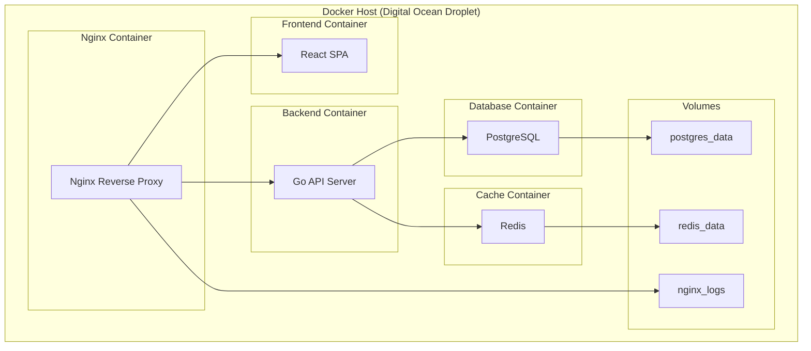

# Docker Configuration Guide

## 1. Overview

This document provides comprehensive Docker configuration for the Finance Manager application, including multi-container setup with PostgreSQL, Redis, Nginx reverse proxy, Go backend, and React frontend.

## 2. Container Architecture



## 3. Docker Compose Configuration

### 3.1 Main Docker Compose File

```yaml
# docker-compose.yml
version: "3.8"

services:
  # Nginx Reverse Proxy
  nginx:
    image: nginx:1.25-alpine
    container_name: finance-nginx
    restart: unless-stopped
    ports:
      - "80:80"
      - "443:443"
    volumes:
      - ./nginx/nginx.conf:/etc/nginx/nginx.conf:ro
      - ./nginx/ssl:/etc/nginx/ssl:ro
      - nginx_logs:/var/log/nginx
    depends_on:
      - frontend
      - backend
    networks:
      - finance-network
    healthcheck:
      test: ["CMD", "nginx", "-t"]
      interval: 30s
      timeout: 10s
      retries: 3

  # React Frontend
  frontend:
    build:
      context: ./frontend
      dockerfile: Dockerfile
      target: production
    container_name: finance-frontend
    restart: unless-stopped
    environment:
      - NODE_ENV=production
      - VITE_API_URL=/api
    networks:
      - finance-network
    healthcheck:
      test: ["CMD", "curl", "-f", "http://localhost:3000"]
      interval: 30s
      timeout: 10s
      retries: 3

  # Go Backend API
  backend:
    build:
      context: ./backend
      dockerfile: Dockerfile
      target: production
    container_name: finance-backend
    restart: unless-stopped
    environment:
      - APP_ENV=production
      - APP_PORT=8080
      - APP_DEBUG=false
      - DB_HOST=postgres
      - DB_PORT=5432
      - DB_NAME=${DB_NAME:-finance_manager}
      - DB_USER=${DB_USER:-finance_user}
      - DB_PASSWORD=${DB_PASSWORD}
      - DB_SSL_MODE=disable
      - REDIS_URL=redis:6379
      - JWT_SECRET=${JWT_SECRET}
      - JWT_EXPIRY=24h
      - JWT_REFRESH_EXPIRY=168h
      - OPENROUTER_API_KEY=${OPENROUTER_API_KEY}
      - SMTP_HOST=${SMTP_HOST}
      - SMTP_PORT=${SMTP_PORT}
      - SMTP_USER=${SMTP_USER}
      - SMTP_PASSWORD=${SMTP_PASSWORD}
    depends_on:
      postgres:
        condition: service_healthy
      redis:
        condition: service_healthy
    networks:
      - finance-network
    healthcheck:
      test: ["CMD", "curl", "-f", "http://localhost:8080/health"]
      interval: 30s
      timeout: 10s
      retries: 3
      start_period: 40s

  # PostgreSQL Database
  postgres:
    image: postgres:15-alpine
    container_name: finance-postgres
    restart: unless-stopped
    environment:
      - POSTGRES_DB=${DB_NAME:-finance_manager}
      - POSTGRES_USER=${DB_USER:-finance_user}
      - POSTGRES_PASSWORD=${DB_PASSWORD}
      - POSTGRES_INITDB_ARGS=--encoding=UTF-8 --lc-collate=C --lc-ctype=C
    volumes:
      - postgres_data:/var/lib/postgresql/data
      - ./backend/migrations:/docker-entrypoint-initdb.d:ro
      - ./postgres/postgresql.conf:/etc/postgresql/postgresql.conf:ro
    ports:
      - "5432:5432" # Remove in production
    networks:
      - finance-network
    healthcheck:
      test:
        [
          "CMD-SHELL",
          "pg_isready -U ${DB_USER:-finance_user} -d ${DB_NAME:-finance_manager}",
        ]
      interval: 10s
      timeout: 5s
      retries: 5
    command: >
      postgres
      -c config_file=/etc/postgresql/postgresql.conf
      -c log_statement=all
      -c log_destination=stderr
      -c logging_collector=on
      -c log_directory=/var/log/postgresql

  # Redis Cache
  redis:
    image: redis:7-alpine
    container_name: finance-redis
    restart: unless-stopped
    command: >
      redis-server
      --appendonly yes
      --appendfsync everysec
      --maxmemory 256mb
      --maxmemory-policy allkeys-lru
    volumes:
      - redis_data:/data
      - ./redis/redis.conf:/etc/redis/redis.conf:ro
    ports:
      - "6379:6379" # Remove in production
    networks:
      - finance-network
    healthcheck:
      test: ["CMD", "redis-cli", "ping"]
      interval: 10s
      timeout: 5s
      retries: 5

  # Database Backup Service
  db-backup:
    image: postgres:15-alpine
    container_name: finance-db-backup
    restart: "no"
    environment:
      - PGPASSWORD=${DB_PASSWORD}
    volumes:
      - ./backups:/backups
    networks:
      - finance-network
    depends_on:
      - postgres
    command: >
      sh -c '
        while true; do
          pg_dump -h postgres -U ${DB_USER:-finance_user} -d ${DB_NAME:-finance_manager} > /backups/backup_$$(date +%Y%m%d_%H%M%S).sql
          find /backups -name "backup_*.sql" -mtime +7 -delete
          sleep 86400
        done
      '

volumes:
  postgres_data:
    driver: local
  redis_data:
    driver: local
  nginx_logs:
    driver: local

networks:
  finance-network:
    driver: bridge
    ipam:
      config:
        - subnet: 172.20.0.0/16
```

### 3.2 Development Docker Compose Override

```yaml
# docker-compose.override.yml (for development)
version: "3.8"

services:
  frontend:
    build:
      target: development
    volumes:
      - ./frontend/src:/app/src:ro
      - ./frontend/public:/app/public:ro
    environment:
      - NODE_ENV=development
      - VITE_API_URL=http://localhost:8080
    ports:
      - "3000:3000"
    command: bun run dev --host 0.0.0.0

  backend:
    build:
      target: development
    volumes:
      - ./backend:/app:ro
    environment:
      - APP_ENV=development
      - APP_DEBUG=true
    ports:
      - "8080:8080"
    command: go run cmd/server/main.go

  postgres:
    ports:
      - "5432:5432"
    environment:
      - POSTGRES_DB=finance_manager_dev

  redis:
    ports:
      - "6379:6379"
```

## 4. Individual Dockerfiles

### 4.1 Frontend Dockerfile

```dockerfile
# frontend/Dockerfile
FROM oven/bun:1-alpine AS base
WORKDIR /app

# Install dependencies
FROM base AS deps
COPY package.json bun.lockb ./
RUN bun install --frozen-lockfile

# Development stage
FROM base AS development
COPY --from=deps /app/node_modules ./node_modules
COPY . .
EXPOSE 3000
CMD ["bun", "run", "dev", "--host", "0.0.0.0"]

# Build stage
FROM base AS builder
COPY --from=deps /app/node_modules ./node_modules
COPY . .
RUN bun run build

# Production stage
FROM nginx:1.25-alpine AS production
COPY --from=builder /app/dist /usr/share/nginx/html
COPY nginx/frontend.conf /etc/nginx/conf.d/default.conf
EXPOSE 80
CMD ["nginx", "-g", "daemon off;"]
```

### 4.2 Backend Dockerfile

```dockerfile
# backend/Dockerfile
FROM golang:1.21-alpine AS base
WORKDIR /app

# Install build dependencies
RUN apk add --no-cache git ca-certificates tzdata

# Development stage
FROM base AS development
RUN go install github.com/cosmtrek/air@latest
COPY go.mod go.sum ./
RUN go mod download
COPY . .
EXPOSE 8080
CMD ["air", "-c", ".air.toml"]

# Build stage
FROM base AS builder
COPY go.mod go.sum ./
RUN go mod download
COPY . .
RUN CGO_ENABLED=0 GOOS=linux go build -a -installsuffix cgo -o main cmd/server/main.go

# Production stage
FROM alpine:3.18 AS production
RUN apk --no-cache add ca-certificates tzdata curl
WORKDIR /root/
COPY --from=builder /app/main .
COPY --from=builder /app/migrations ./migrations
EXPOSE 8080
HEALTHCHECK --interval=30s --timeout=10s --start-period=5s --retries=3 \
  CMD curl -f http://localhost:8080/health || exit 1
CMD ["./main"]
```

## 5. Configuration Files

### 5.1 Nginx Configuration

```nginx
# nginx/nginx.conf
events {
    worker_connections 1024;
}

http {
    include       /etc/nginx/mime.types;
    default_type  application/octet-stream;

    # Logging
    log_format main '$remote_addr - $remote_user [$time_local] "$request" '
                    '$status $body_bytes_sent "$http_referer" '
                    '"$http_user_agent" "$http_x_forwarded_for"';

    access_log /var/log/nginx/access.log main;
    error_log /var/log/nginx/error.log warn;

    # Basic settings
    sendfile on;
    tcp_nopush on;
    tcp_nodelay on;
    keepalive_timeout 65;
    types_hash_max_size 2048;
    client_max_body_size 10M;

    # Gzip compression
    gzip on;
    gzip_vary on;
    gzip_min_length 1024;
    gzip_types text/plain text/css text/xml text/javascript application/javascript application/xml+rss application/json;

    # Rate limiting
    limit_req_zone $binary_remote_addr zone=api:10m rate=10r/s;
    limit_req_zone $binary_remote_addr zone=login:10m rate=5r/m;

    # Upstream servers
    upstream frontend {
        server frontend:80;
    }

    upstream backend {
        server backend:8080;
    }

    # HTTP to HTTPS redirect
    server {
        listen 80;
        server_name _;
        return 301 https://$host$request_uri;
    }

    # Main server block
    server {
        listen 443 ssl http2;
        server_name your-domain.com;

        # SSL configuration
        ssl_certificate /etc/nginx/ssl/cert.pem;
        ssl_certificate_key /etc/nginx/ssl/key.pem;
        ssl_protocols TLSv1.2 TLSv1.3;
        ssl_ciphers ECDHE-RSA-AES256-GCM-SHA512:DHE-RSA-AES256-GCM-SHA512:ECDHE-RSA-AES256-GCM-SHA384:DHE-RSA-AES256-GCM-SHA384;
        ssl_prefer_server_ciphers off;
        ssl_session_cache shared:SSL:10m;
        ssl_session_timeout 10m;

        # Security headers
        add_header X-Frame-Options DENY;
        add_header X-Content-Type-Options nosniff;
        add_header X-XSS-Protection "1; mode=block";
        add_header Strict-Transport-Security "max-age=31536000; includeSubDomains" always;

        # API routes
        location /api/ {
            limit_req zone=api burst=20 nodelay;

            proxy_pass http://backend;
            proxy_set_header Host $host;
            proxy_set_header X-Real-IP $remote_addr;
            proxy_set_header X-Forwarded-For $proxy_add_x_forwarded_for;
            proxy_set_header X-Forwarded-Proto $scheme;

            # Timeouts
            proxy_connect_timeout 30s;
            proxy_send_timeout 30s;
            proxy_read_timeout 30s;
        }

        # Auth endpoints with stricter rate limiting
        location /api/auth/ {
            limit_req zone=login burst=5 nodelay;

            proxy_pass http://backend;
            proxy_set_header Host $host;
            proxy_set_header X-Real-IP $remote_addr;
            proxy_set_header X-Forwarded-For $proxy_add_x_forwarded_for;
            proxy_set_header X-Forwarded-Proto $scheme;
        }

        # Frontend routes
        location / {
            proxy_pass http://frontend;
            proxy_set_header Host $host;
            proxy_set_header X-Real-IP $remote_addr;
            proxy_set_header X-Forwarded-For $proxy_add_x_forwarded_for;
            proxy_set_header X-Forwarded-Proto $scheme;

            # Handle SPA routing
            try_files $uri $uri/ /index.html;
        }

        # Static assets caching
        location ~* \.(js|css|png|jpg|jpeg|gif|ico|svg|woff|woff2|ttf|eot)$ {
            expires 1y;
            add_header Cache-Control "public, immutable";
            proxy_pass http://frontend;
        }

        # Health check endpoint
        location /health {
            access_log off;
            return 200 "healthy\n";
            add_header Content-Type text/plain;
        }
    }
}
```

### 5.2 PostgreSQL Configuration

```conf
# postgres/postgresql.conf
# Memory settings
shared_buffers = 256MB
effective_cache_size = 1GB
work_mem = 4MB
maintenance_work_mem = 64MB

# Connection settings
max_connections = 100
listen_addresses = '*'
port = 5432

# Logging
log_destination = 'stderr'
logging_collector = on
log_directory = '/var/log/postgresql'
log_filename = 'postgresql-%Y-%m-%d_%H%M%S.log'
log_statement = 'all'
log_min_duration_statement = 1000

# Performance
checkpoint_completion_target = 0.9
wal_buffers = 16MB
default_statistics_target = 100
random_page_cost = 1.1
effective_io_concurrency = 200

# Security
ssl = off
password_encryption = scram-sha-256
```

### 5.3 Redis Configuration

```conf
# redis/redis.conf
# Network
bind 0.0.0.0
port 6379
tcp-backlog 511
timeout 0
tcp-keepalive 300

# General
daemonize no
supervised no
pidfile /var/run/redis_6379.pid
loglevel notice
logfile ""
databases 16

# Persistence
save 900 1
save 300 10
save 60 10000
stop-writes-on-bgsave-error yes
rdbcompression yes
rdbchecksum yes
dbfilename dump.rdb
dir ./

# AOF
appendonly yes
appendfilename "appendonly.aof"
appendfsync everysec
no-appendfsync-on-rewrite no
auto-aof-rewrite-percentage 100
auto-aof-rewrite-min-size 64mb

# Memory management
maxmemory 256mb
maxmemory-policy allkeys-lru
maxmemory-samples 5

# Security
requirepass ""
```

## 6. Environment Configuration

### 6.1 Production Environment File

```env
# .env.production
# Database
DB_NAME=finance_manager
DB_USER=finance_user
DB_PASSWORD=your-secure-database-password

# JWT
JWT_SECRET=your-super-secure-jwt-secret-key-minimum-32-characters

# AI Services
OPENROUTER_API_KEY=your-openrouter-api-key

# Email
SMTP_HOST=smtp.gmail.com
SMTP_PORT=587
SMTP_USER=your-email@gmail.com
SMTP_PASSWORD=your-app-specific-password

# Domain
DOMAIN=your-domain.com
```

### 6.2 Development Environment File

```env
# .env.development
# Database
DB_NAME=finance_manager_dev
DB_USER=finance_user
DB_PASSWORD=dev_password

# JWT
JWT_SECRET=dev-jwt-secret-key-for-development-only

# AI Services
OPENROUTER_API_KEY=your-dev-openrouter-api-key

# Email (use Mailhog for development)
SMTP_HOST=mailhog
SMTP_PORT=1025
SMTP_USER=
SMTP_PASSWORD=

# Domain
DOMAIN=localhost
```

## 7. Docker Management Scripts

### 7.1 Deployment Script

```bash
#!/bin/bash
# scripts/deploy.sh

set -e

echo "🚀 Starting Finance Manager deployment..."

# Load environment variables
if [ -f .env.production ]; then
    export $(cat .env.production | xargs)
else
    echo "❌ .env.production file not found"
    exit 1
fi

# Pull latest changes
echo "📥 Pulling latest changes..."
git pull origin main

# Build and deploy
echo "🔨 Building and starting containers..."
docker-compose -f docker-compose.yml down
docker-compose -f docker-compose.yml build --no-cache
docker-compose -f docker-compose.yml up -d

# Wait for services to be healthy
echo "⏳ Waiting for services to be healthy..."
sleep 30

# Check service health
echo "🔍 Checking service health..."
docker-compose ps

# Run database migrations
echo "🗄️ Running database migrations..."
docker-compose exec backend ./main migrate

echo "✅ Deployment completed successfully!"
echo "🌐 Application is available at https://$DOMAIN"
```

### 7.2 Backup Script

```bash
#!/bin/bash
# scripts/backup.sh

set -e

BACKUP_DIR="./backups"
DATE=$(date +%Y%m%d_%H%M%S)
BACKUP_FILE="$BACKUP_DIR/finance_manager_backup_$DATE.sql"

echo "📦 Creating database backup..."

# Create backup directory if it doesn't exist
mkdir -p $BACKUP_DIR

# Create database backup
docker-compose exec -T postgres pg_dump -U finance_user finance_manager > $BACKUP_FILE

# Compress backup
gzip $BACKUP_FILE

echo "✅ Backup created: ${BACKUP_FILE}.gz"

# Clean up old backups (keep last 7 days)
find $BACKUP_DIR -name "*.gz" -mtime +7 -delete

echo "🧹 Old backups cleaned up"
```

### 7.3 Development Setup Script

```bash
#!/bin/bash
# scripts/dev-setup.sh

set -e

echo "🛠️ Setting up development environment..."

# Copy environment file
if [ ! -f .env.development ]; then
    cp .env.example .env.development
    echo "📝 Created .env.development file - please update with your settings"
fi

# Start development containers
echo "🚀 Starting development containers..."
docker-compose -f docker-compose.yml -f docker-compose.override.yml up -d

# Wait for database to be ready
echo "⏳ Waiting for database to be ready..."
sleep 10

# Run migrations
echo "🗄️ Running database migrations..."
docker-compose exec backend go run cmd/migrate/main.go

# Install frontend dependencies
echo "📦 Installing frontend dependencies..."
docker-compose exec frontend bun install

echo "✅ Development environment is ready!"
echo "🌐 Frontend: http://localhost:3000"
echo "🔧 Backend API: http://localhost:8080"
echo "🗄️ Database: localhost:5432"
echo "🔴 Redis: localhost:6379"
```

## 8. Monitoring and Logging

### 8.1 Docker Compose Monitoring Extension

```yaml
# docker-compose.monitoring.yml
version: "3.8"

services:
  # Prometheus for metrics
  prometheus:
    image: prom/prometheus:latest
    container_name: finance-prometheus
    restart: unless-stopped
    ports:
      - "9090:9090"
    volumes:
      - ./monitoring/prometheus.yml:/etc/prometheus/prometheus.yml:ro
      - prometheus_data:/prometheus
    networks:
      - finance-network

  # Grafana for visualization
  grafana:
    image: grafana/grafana:latest
    container_name: finance-grafana
    restart: unless-stopped
    ports:
      - "3001:3000"
    environment:
      - GF_SECURITY_ADMIN_PASSWORD=admin
    volumes:
      - grafana_data:/var/lib/grafana
      - ./monitoring/grafana/dashboards:/etc/grafana/provisioning/dashboards:ro
      - ./monitoring/grafana/datasources:/etc/grafana/provisioning/datasources:ro
    networks:
      - finance-network

  # Log aggregation
  loki:
    image: grafana/loki:latest
    container_name: finance-loki
    restart: unless-stopped
    ports:
      - "3100:3100"
    volumes:
      - ./monitoring/loki.yml:/etc/loki/local-config.yaml:ro
      - loki_data:/loki
    networks:
      - finance-network

volumes:
  prometheus_data:
  grafana_data:
  loki_data:
```

### 8.2 Health Check Script

```bash
#!/bin/bash
# scripts/health-check.sh

set -e

echo "🔍 Checking Finance Manager health..."

# Check container status
echo "📦 Container Status:"
docker-compose ps

# Check service endpoints
echo "\n🌐 Service Health Checks:"

# Frontend
if curl -f http://localhost:3000 > /dev/null 2>&1; then
    echo "✅ Frontend: Healthy"
else
    echo "❌ Frontend: Unhealthy"
fi

# Backend
if curl -f http://localhost:8080/health > /dev/null 2>&1; then
    echo "✅ Backend: Healthy"
else
    echo "❌ Backend: Unhealthy"
fi

# Database
if docker-compose exec -T postgres pg_isready -U finance_user > /dev/null 2>&1; then
    echo "✅ Database: Healthy"
else
    echo "❌ Database: Unhealthy"
fi

# Redis
if docker-compose exec -T redis redis-cli ping > /dev/null 2>&1; then
    echo "✅ Redis: Healthy"
else
    echo "❌ Redis: Unhealthy"
fi

echo "\n📊 Resource Usage:"
docker stats --no-stream --format "table {{.Container}}\t{{.CPUPerc}}\t{{.MemUsage}}\t{{.NetIO}}\t{{.BlockIO}}"
```

This Docker configuration provides a complete containerized setup for the Finance Manager application with proper service orchestration, health checks, monitoring, and management scripts for both development and production environments.
