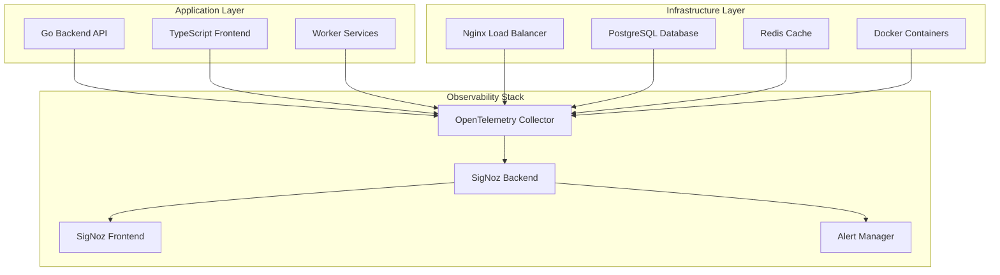

# OpenTelemetry & SigNoz Observability Architecture

## 1. Architecture Overview

### 1.1 Core Components



### 1.2 Technology Stack Integration

| Component           | Current Stack     | OpenTelemetry Integration  | SigNoz Role           |
| ------------------- | ----------------- | -------------------------- | --------------------- |
| Go Backend          | Gin Framework     | `go.opentelemetry.io/otel` | Traces, Metrics, Logs |
| TypeScript Frontend | Astro/React       | `@opentelemetry/web`       | Browser traces, RUM   |
| Docker              | Container Runtime | OTEL Collector sidecar     | Container metrics     |
| Nginx               | Web Server        | `nginx-otel` module        | HTTP metrics, traces  |
| PostgreSQL          | Database          | `pgx` instrumentation      | DB performance        |
| Redis               | Cache             | `redis` instrumentation    | Cache metrics         |

## 2. Implementation Strategy

### 2.1 Phase 1: Core Infrastructure Setup

#### SigNoz Deployment

```yaml
# docker-compose.observability.yml
version: '3.8'
services:
  # ClickHouse for metrics and traces
  clickhouse:
    image: clickhouse/clickhouse-server:22.8-alpine
    container_name: signoz-clickhouse
    hostname: clickhouse
    ports:
      - "9000:9000"
      - "8123:8123"
      - "9181:9181"
    volumes:
      - ./clickhouse-config.xml:/etc/clickhouse-server/config.xml
      - ./clickhouse-users.xml:/etc/clickhouse-server/users.xml
      - ./custom-function.xml:/etc/clickhouse-server/custom-function.xml
      - ./clickhouse-cluster.xml:/etc/clickhouse-server/config.d/cluster.xml
      - signoz-clickhouse-data:/var/lib/clickhouse/
    environment:
      - CLICKHOUSE_DB=signoz_traces
      - CLICKHOUSE_USER=signoz
      - CLICKHOUSE_PASSWORD=signoz
    restart: on-failure
    healthcheck:
      test: ["CMD", "wget", "--spider", "-q", "localhost:8123/ping"]
      interval: 30s
      timeout: 5s
      retries: 3

  # OpenTelemetry Collector
  otel-collector:
    image: signoz/signoz-otel-collector:0.88.11
    container_name: signoz-otel-collector
    command: ["--config=/etc/otelcol-contrib/otel-collector-config.yaml"]
    volumes:
      - ./otel-collector-config.yaml:/etc/otelcol-contrib/otel-collector-config.yaml
    environment:
      - OTEL_RESOURCE_ATTRIBUTES=service.name=signoz-otel-collector,service.version=0.88.11
    ports:
      - "1777:1777"     # pprof extension
      - "4317:4317"     # OTLP gRPC receiver
      - "4318:4318"     # OTLP HTTP receiver
      - "8888:8888"     # OtelCollector internal metrics
      - "8889:8889"     # signoz spanmetrics exposed by the agent
      - "9411:9411"     # Zipkin port
      - "13133:13133"   # health_check extension
      - "14250:14250"   # Jaeger gRPC
      - "14268:14268"   # Jaeger thrift HTTP
    restart: on-failure
    depends_on:
      clickhouse:
        condition: service_healthy

  # SigNoz Query Service
  query-service:
    image: signoz/signoz:0.39.0
    container_name: signoz-query-service
    command: ["-config=/root/config/prometheus.yml"]
    volumes:
      - ./prometheus.yml:/root/config/prometheus.yml
      - ../dashboards:/root/config/dashboards
      - signoz-data:/var/lib/signoz/
    environment:
      - ClickHouseUrl=tcp://clickhouse:9000
      - ALERTMANAGER_API_PREFIX=http://alertmanager:9093/api/v1
      - SIGNOZ_LOCAL_DB_PATH=/var/lib/signoz/signoz.db
      - DASHBOARDS_PATH=/root/config/dashboards
      - STORAGE=clickhouse
      - GODEBUG=netdns=go
      - TELEMETRY_ENABLED=true
      - DEPLOYMENT_TYPE=docker-standalone-amd
    restart: on-failure
    healthcheck:
      test: ["CMD", "wget", "--spider", "-q", "localhost:8080/api/v1/health"]
      interval: 30s
      timeout: 5s
      retries: 3
    depends_on:
      clickhouse:
        condition: service_healthy
      otel-collector:
        condition: service_started
    ports:
      - "8080:8080"

  # SigNoz Frontend
  frontend:
    image: signoz/signoz-frontend:0.39.0
    container_name: signoz-frontend
    restart: on-failure
    depends_on:
      - alertmanager
      - query-service
    ports:
      - "3301:3301"
    volumes:
      - ../common/nginx-config.conf:/etc/nginx/conf.d/default.conf

  # Alert Manager
  alertmanager:
    image: signoz/alertmanager:0.23.5
    container_name: signoz-alertmanager
    volumes:
      - ./alertmanager-config.yml:/etc/alertmanager/config.yml
    command:
      - --queryURL=http://query-service:8080
      - --rules=/etc/alertmanager/rules.yml
    restart: on-failure
    healthcheck:
      test: ["CMD", "wget", "--spider", "-q", "localhost:9093/-/healthy"]
      interval: 30s
      timeout: 5s
      retries: 3
    depends_on:
      query-service:
        condition: service_healthy
    ports:
      - "9093:9093"

volumes:
  signoz-clickhouse-data:
  signoz-data:
```

#### OpenTelemetry Collector Configuration

```yaml
# otel-collector-config.yaml
receivers:
  otlp:
    protocols:
      grpc:
        endpoint: 0.0.0.0:4317
      http:
        endpoint: 0.0.0.0:4318
  jaeger:
    protocols:
      grpc:
        endpoint: 0.0.0.0:14250
      thrift_http:
        endpoint: 0.0.0.0:14268
  zipkin:
    endpoint: 0.0.0.0:9411
  prometheus:
    config:
      scrape_configs:
        - job_name: 'otel-collector'
          scrape_interval: 10s
          static_configs:
            - targets: ['0.0.0.0:8888']
        - job_name: 'finance-manager-backend'
          scrape_interval: 15s
          static_configs:
            - targets: ['backend:8080']
        - job_name: 'nginx'
          scrape_interval: 15s
          static_configs:
            - targets: ['nginx:9113']
        - job_name: 'redis'
          scrape_interval: 15s
          static_configs:
            - targets: ['redis:6379']
        - job_name: 'postgres'
          scrape_interval: 15s
          static_configs:
            - targets: ['postgres:5432']

processors:
  batch:
    timeout: 1s
    send_batch_size: 1024
  memory_limiter:
    limit_mib: 512
  resource:
    attributes:
      - key: service.namespace
        value: finance-manager
        action: upsert

exporters:
  clickhouse:
    endpoint: tcp://clickhouse:9000?dial_timeout=10s&compress=lz4
    database: signoz_traces
    username: signoz
    password: signoz
    ttl_days: 3
    logs_table_name: signoz_logs
    traces_table_name: signoz_traces
    metrics_table_name: signoz_metrics
  prometheus:
    endpoint: "0.0.0.0:8889"
    namespace: signoz
    const_labels:
      cluster: finance-manager

service:
  pipelines:
    traces:
      receivers: [otlp, jaeger, zipkin]
      processors: [memory_limiter, batch, resource]
      exporters: [clickhouse]
    metrics:
      receivers: [otlp, prometheus]
      processors: [memory_limiter, batch, resource]
      exporters: [clickhouse, prometheus]
    logs:
      receivers: [otlp]
      processors: [memory_limiter, batch, resource]
      exporters: [clickhouse]
  extensions: [health_check, pprof, zpages]
```

### 2.2 Phase 2: Go Backend Instrumentation

#### Dependencies

```go
// go.mod additions
require (
    go.opentelemetry.io/otel v1.21.0
    go.opentelemetry.io/otel/exporters/otlp/otlptrace/otlptracegrpc v1.21.0
    go.opentelemetry.io/otel/exporters/otlp/otlpmetric/otlpmetricgrpc v0.44.0
    go.opentelemetry.io/otel/exporters/prometheus v0.44.0
    go.opentelemetry.io/otel/sdk v1.21.0
    go.opentelemetry.io/otel/sdk/metric v1.21.0
    go.opentelemetry.io/contrib/instrumentation/github.com/gin-gonic/gin/otelgin v0.46.1
    go.opentelemetry.io/contrib/instrumentation/database/sql/otelsql v0.46.1
    go.opentelemetry.io/contrib/instrumentation/github.com/go-redis/redis/v8/otelredis v0.46.1
    go.opentelemetry.io/otel/exporters/stdout/stdouttrace v1.21.0
    go.opentelemetry.io/otel/exporters/stdout/stdoutmetric v0.44.0
)
```

#### Telemetry Package

```go
// pkg/telemetry/telemetry.go
package telemetry

import (
    "context"
    "fmt"
    "time"

    "go.opentelemetry.io/otel"
    "go.opentelemetry.io/otel/attribute"
    "go.opentelemetry.io/otel/exporters/otlp/otlptrace/otlptracegrpc"
    "go.opentelemetry.io/otel/exporters/otlp/otlpmetric/otlpmetricgrpc"
    "go.opentelemetry.io/otel/exporters/prometheus"
    "go.opentelemetry.io/otel/metric"
    "go.opentelemetry.io/otel/propagation"
    "go.opentelemetry.io/otel/sdk/resource"
    sdktrace "go.opentelemetry.io/otel/sdk/trace"
    sdkmetric "go.opentelemetry.io/otel/sdk/metric"
    semconv "go.opentelemetry.io/otel/semconv/v1.21.0"
    "go.opentelemetry.io/otel/trace"
)

type Config struct {
    ServiceName    string
    ServiceVersion string
    Environment    string
    OTLPEndpoint   string
    MetricsPort    string
}

type Telemetry struct {
    tracer         trace.Tracer
    meter          metric.Meter
    traceProvider  *sdktrace.TracerProvider
    metricProvider *sdkmetric.MeterProvider
    config         Config
}

func New(config Config) (*Telemetry, error) {
    ctx := context.Background()
    
    // Create resource
    res, err := resource.New(ctx,
        resource.WithAttributes(
            semconv.ServiceName(config.ServiceName),
            semconv.ServiceVersion(config.ServiceVersion),
            semconv.DeploymentEnvironment(config.Environment),
            attribute.String("service.namespace", "finance-manager"),
        ),
    )
    if err != nil {
        return nil, fmt.Errorf("failed to create resource: %w", err)
    }

    // Setup tracing
    traceExporter, err := otlptracegrpc.New(ctx,
        otlptracegrpc.WithEndpoint(config.OTLPEndpoint),
        otlptracegrpc.WithInsecure(),
    )
    if err != nil {
        return nil, fmt.Errorf("failed to create trace exporter: %w", err)
    }

    traceProvider := sdktrace.NewTracerProvider(
        sdktrace.WithBatcher(traceExporter),
        sdktrace.WithResource(res),
        sdktrace.WithSampler(sdktrace.AlwaysSample()),
    )
    otel.SetTracerProvider(traceProvider)
    otel.SetTextMapPropagator(propagation.TraceContext{})

    // Setup metrics
    metricExporter, err := otlpmetricgrpc.New(ctx,
        otlpmetricgrpc.WithEndpoint(config.OTLPEndpoint),
        otlpmetricgrpc.WithInsecure(),
    )
    if err != nil {
        return nil, fmt.Errorf("failed to create metric exporter: %w", err)
    }

    // Prometheus exporter for pull-based metrics
    promExporter, err := prometheus.New()
    if err != nil {
        return nil, fmt.Errorf("failed to create prometheus exporter: %w", err)
    }

    metricProvider := sdkmetric.NewMeterProvider(
        sdkmetric.WithReader(sdkmetric.NewPeriodicReader(metricExporter,
            sdkmetric.WithInterval(15*time.Second))),
        sdkmetric.WithReader(promExporter),
        sdkmetric.WithResource(res),
    )
    otel.SetMeterProvider(metricProvider)

    tracer := otel.Tracer(config.ServiceName)
    meter := otel.Meter(config.ServiceName)

    return &Telemetry{
        tracer:         tracer,
        meter:          meter,
        traceProvider:  traceProvider,
        metricProvider: metricProvider,
        config:         config,
    }, nil
}

func (t *Telemetry) Tracer() trace.Tracer {
    return t.tracer
}

func (t *Telemetry) Meter() metric.Meter {
    return t.meter
}

func (t *Telemetry) Shutdown(ctx context.Context) error {
    if err := t.traceProvider.Shutdown(ctx); err != nil {
        return fmt.Errorf("failed to shutdown trace provider: %w", err)
    }
    if err := t.metricProvider.Shutdown(ctx); err != nil {
        return fmt.Errorf("failed to shutdown metric provider: %w", err)
    }
    return nil
}
```

#### Middleware Integration

```go
// internal/middleware/telemetry.go
package middleware

import (
    "context"
    "time"

    "github.com/gin-gonic/gin"
    "go.opentelemetry.io/contrib/instrumentation/github.com/gin-gonic/gin/otelgin"
    "go.opentelemetry.io/otel"
    "go.opentelemetry.io/otel/attribute"
    "go.opentelemetry.io/otel/metric"
    "go.opentelemetry.io/otel/trace"
)

type TelemetryMiddleware struct {
    tracer              trace.Tracer
    requestCounter      metric.Int64Counter
    requestDuration     metric.Float64Histogram
    activeConnections   metric.Int64UpDownCounter
}

func NewTelemetryMiddleware() *TelemetryMiddleware {
    tracer := otel.Tracer("finance-manager-middleware")
    meter := otel.Meter("finance-manager-middleware")

    requestCounter, _ := meter.Int64Counter(
        "http_requests_total",
        metric.WithDescription("Total number of HTTP requests"),
    )

    requestDuration, _ := meter.Float64Histogram(
        "http_request_duration_seconds",
        metric.WithDescription("HTTP request duration in seconds"),
        metric.WithUnit("s"),
    )

    activeConnections, _ := meter.Int64UpDownCounter(
        "http_active_connections",
        metric.WithDescription("Number of active HTTP connections"),
    )

    return &TelemetryMiddleware{
        tracer:            tracer,
        requestCounter:    requestCounter,
        requestDuration:   requestDuration,
        activeConnections: activeConnections,
    }
}

func (tm *TelemetryMiddleware) Handler() gin.HandlerFunc {
    return gin.HandlerFunc(func(c *gin.Context) {
        start := time.Now()
        
        // Increment active connections
        tm.activeConnections.Add(c.Request.Context(), 1)
        defer tm.activeConnections.Add(c.Request.Context(), -1)

        // Add custom attributes to span
        span := trace.SpanFromContext(c.Request.Context())
        span.SetAttributes(
            attribute.String("http.user_agent", c.Request.UserAgent()),
            attribute.String("http.remote_addr", c.ClientIP()),
        )

        c.Next()

        // Record metrics
        duration := time.Since(start).Seconds()
        status := c.Writer.Status()
        
        labels := []attribute.KeyValue{
            attribute.String("method", c.Request.Method),
            attribute.String("route", c.FullPath()),
            attribute.Int("status_code", status),
        }

        tm.requestCounter.Add(c.Request.Context(), 1, metric.WithAttributes(labels...))
        tm.requestDuration.Record(c.Request.Context(), duration, metric.WithAttributes(labels...))
    })
}

// OpenTelemetry Gin middleware wrapper
func OpenTelemetry(serviceName string) gin.HandlerFunc {
    return otelgin.Middleware(serviceName)
}
```

#### Database Instrumentation

```go
// pkg/database/instrumented.go
package database

import (
    "database/sql"
    "fmt"

    "go.opentelemetry.io/contrib/instrumentation/database/sql/otelsql"
    semconv "go.opentelemetry.io/otel/semconv/v1.21.0"
    _ "github.com/lib/pq"
)

func NewInstrumentedDB(dsn string) (*sql.DB, error) {
    // Register the otelsql wrapper for the postgres driver
    driverName, err := otelsql.Register("postgres",
        otelsql.WithAttributes(semconv.DBSystemPostgreSQL),
        otelsql.WithSpanOptions(otelsql.SpanOptions{
            Ping:                 true,
            RowsNext:             true,
            RowsClose:            true,
            RowsAffected:         true,
            LastInsertID:         true,
            Query:                true,
            QueryContext:         true,
            Exec:                 true,
            ExecContext:          true,
            Prepare:              true,
            PrepareContext:       true,
            StmtExec:             true,
            StmtExecContext:      true,
            StmtQuery:            true,
            StmtQueryContext:     true,
            StmtClose:            true,
            ConnectorConnect:     true,
            ConnPing:             true,
            ConnPrepare:          true,
            ConnPrepareContext:   true,
            ConnExec:             true,
            ConnExecContext:      true,
            ConnQuery:            true,
            ConnQueryContext:     true,
            ConnBeginTx:          true,
            TxCommit:             true,
            TxRollback:           true,
        }),
    )
    if err != nil {
        return nil, fmt.Errorf("failed to register otelsql driver: %w", err)
    }

    db, err := sql.Open(driverName, dsn)
    if err != nil {
        return nil, fmt.Errorf("failed to open database: %w", err)
    }

    return db, nil
}
```

#### Redis Instrumentation

```go
// pkg/redis/instrumented.go
package redis

import (
    "github.com/go-redis/redis/v8"
    "go.opentelemetry.io/contrib/instrumentation/github.com/go-redis/redis/v8/otelredis"
)

func NewInstrumentedClient(config Config) *redis.Client {
    rdb := redis.NewClient(&redis.Options{
        Addr:     fmt.Sprintf("%s:%d", config.Host, config.Port),
        Password: config.Password,
        DB:       config.DB,
    })

    // Add OpenTelemetry instrumentation
    rdb.AddHook(otelredis.NewTracingHook())

    return rdb
}
```

### 2.3 Phase 3: TypeScript Frontend Instrumentation

#### Dependencies

```json
{
  "dependencies": {
    "@opentelemetry/api": "^1.7.0",
    "@opentelemetry/sdk-web": "^1.18.1",
    "@opentelemetry/auto-instrumentations-web": "^0.35.0",
    "@opentelemetry/exporter-otlp-http": "^0.45.1",
    "@opentelemetry/instrumentation-fetch": "^0.45.1",
    "@opentelemetry/instrumentation-xml-http-request": "^0.45.1",
    "@opentelemetry/instrumentation-user-interaction": "^0.35.1",
    "@opentelemetry/instrumentation-document-load": "^0.35.1",
    "@opentelemetry/context-zone": "^1.18.1",
    "@opentelemetry/propagator-b3": "^1.18.1",
    "@opentelemetry/propagator-jaeger": "^1.18.1",
    "@opentelemetry/resources": "^1.18.1",
    "@opentelemetry/semantic-conventions": "^1.18.1"
  }
}
```

#### Telemetry Setup

```typescript
// src/lib/telemetry/index.ts
import { WebSDK } from '@opentelemetry/sdk-web';
import { getWebAutoInstrumentations } from '@opentelemetry/auto-instrumentations-web';
import { OTLPTraceExporter } from '@opentelemetry/exporter-otlp-http';
import { Resource } from '@opentelemetry/resources';
import { SemanticResourceAttributes } from '@opentelemetry/semantic-conventions';
import { B3Propagator } from '@opentelemetry/propagator-b3';
import { JaegerPropagator } from '@opentelemetry/propagator-jaeger';
import { CompositePropagator, W3CTraceContextPropagator } from '@opentelemetry/core';

interface TelemetryConfig {
  serviceName: string;
  serviceVersion: string;
  environment: string;
  otlpEndpoint: string;
  enableConsoleExporter?: boolean;
}

class TelemetryService {
  private sdk: WebSDK | null = null;
  private config: TelemetryConfig;

  constructor(config: TelemetryConfig) {
    this.config = config;
  }

  initialize(): void {
    const resource = new Resource({
      [SemanticResourceAttributes.SERVICE_NAME]: this.config.serviceName,
      [SemanticResourceAttributes.SERVICE_VERSION]: this.config.serviceVersion,
      [SemanticResourceAttributes.DEPLOYMENT_ENVIRONMENT]: this.config.environment,
      'service.namespace': 'finance-manager',
    });

    const traceExporter = new OTLPTraceExporter({
      url: `${this.config.otlpEndpoint}/v1/traces`,
      headers: {
        'Content-Type': 'application/json',
      },
    });

    this.sdk = new WebSDK({
      resource,
      traceExporter,
      instrumentations: [
        getWebAutoInstrumentations({
          '@opentelemetry/instrumentation-fs': {
            enabled: false,
          },
          '@opentelemetry/instrumentation-fetch': {
            enabled: true,
            propagateTraceHeaderCorsUrls: [
              new RegExp(`${window.location.origin}/api/.*`),
              /^https:\/\/api\.finance-manager\..*/,
            ],
            clearTimingResources: true,
            applyCustomAttributesOnSpan: (span, request, result) => {
              span.setAttributes({
                'http.request.body.size': request.body?.toString().length || 0,
                'http.response.body.size': result.headers.get('content-length') || 0,
              });
            },
          },
          '@opentelemetry/instrumentation-xml-http-request': {
            enabled: true,
            propagateTraceHeaderCorsUrls: [
              new RegExp(`${window.location.origin}/api/.*`),
            ],
          },
          '@opentelemetry/instrumentation-user-interaction': {
            enabled: true,
            eventNames: ['click', 'submit', 'keydown'],
          },
          '@opentelemetry/instrumentation-document-load': {
            enabled: true,
          },
        }),
      ],
      spanProcessor: undefined, // Use default
      textMapPropagator: new CompositePropagator({
        propagators: [
          new W3CTraceContextPropagator(),
          new B3Propagator(),
          new JaegerPropagator(),
        ],
      }),
    });

    this.sdk.start();
    console.log('OpenTelemetry initialized successfully');
  }

  shutdown(): Promise<void> {
    if (this.sdk) {
      return this.sdk.shutdown();
    }
    return Promise.resolve();
  }
}

// Initialize telemetry
const telemetryConfig: TelemetryConfig = {
  serviceName: 'finance-manager-frontend',
  serviceVersion: '1.0.0',
  environment: import.meta.env.MODE || 'development',
  otlpEndpoint: import.meta.env.VITE_OTEL_ENDPOINT || 'http://localhost:4318',
  enableConsoleExporter: import.meta.env.MODE === 'development',
};

export const telemetryService = new TelemetryService(telemetryConfig);

// Auto-initialize in browser
if (typeof window !== 'undefined') {
  telemetryService.initialize();
}
```

#### Custom Instrumentation

```typescript
// src/lib/telemetry/custom-instrumentation.ts
import { trace, context, SpanStatusCode, SpanKind } from '@opentelemetry/api';

const tracer = trace.getTracer('finance-manager-frontend', '1.0.0');

export class CustomInstrumentation {
  // Track user interactions
  static trackUserAction(actionName: string, attributes: Record<string, any> = {}) {
    const span = tracer.startSpan(`user.${actionName}`, {
      kind: SpanKind.CLIENT,
      attributes: {
        'user.action': actionName,
        'user.timestamp': Date.now(),
        ...attributes,
      },
    });

    return {
      end: (error?: Error) => {
        if (error) {
          span.recordException(error);
          span.setStatus({ code: SpanStatusCode.ERROR, message: error.message });
        } else {
          span.setStatus({ code: SpanStatusCode.OK });
        }
        span.end();
      },
      addEvent: (name: string, attributes?: Record<string, any>) => {
        span.addEvent(name, attributes);
      },
      setAttributes: (attributes: Record<string, any>) => {
        span.setAttributes(attributes);
      },
    };
  }

  // Track API calls
  static async trackApiCall<T>(
    operationName: string,
    apiCall: () => Promise<T>,
    attributes: Record<string, any> = {}
  ): Promise<T> {
    const span = tracer.startSpan(`api.${operationName}`, {
      kind: SpanKind.CLIENT,
      attributes: {
        'api.operation': operationName,
        ...attributes,
      },
    });

    try {
      const result = await context.with(trace.setSpan(context.active(), span), apiCall);
      span.setStatus({ code: SpanStatusCode.OK });
      return result;
    } catch (error) {
      span.recordException(error as Error);
      span.setStatus({ code: SpanStatusCode.ERROR, message: (error as Error).message });
      throw error;
    } finally {
      span.end();
    }
  }

  // Track page views
  static trackPageView(pageName: string, attributes: Record<string, any> = {}) {
    const span = tracer.startSpan(`page.view`, {
      kind: SpanKind.CLIENT,
      attributes: {
        'page.name': pageName,
        'page.url': window.location.href,
        'page.referrer': document.referrer,
        ...attributes,
      },
    });
    
    span.end();
  }

  // Track form submissions
  static trackFormSubmission(formName: string, success: boolean, attributes: Record<string, any> = {}) {
    const span = tracer.startSpan(`form.submit`, {
      kind: SpanKind.CLIENT,
      attributes: {
        'form.name': formName,
        'form.success': success,
        ...attributes,
      },
    });
    
    span.setStatus({ 
      code: success ? SpanStatusCode.OK : SpanStatusCode.ERROR 
    });
    span.end();
  }
}
```

### 2.4 Phase 4: Infrastructure Instrumentation

#### Nginx Configuration

```nginx
# nginx/nginx.conf
load_module modules/ngx_http_opentracing_module.so;

http {
    # OpenTracing configuration
    opentracing_load_tracer /usr/local/lib/libjaegertracing_plugin.so /etc/nginx/jaeger-config.json;
    opentracing on;
    opentracing_tag http_user_agent $http_user_agent;
    opentracing_tag http_host $http_host;
    opentracing_tag request_id $request_id;
    
    # Prometheus metrics
    server {
        listen 9113;
        location /metrics {
            stub_status on;
            access_log off;
            allow 172.16.0.0/12;
            deny all;
        }
    }
    
    upstream backend {
        server backend:8080;
    }
    
    upstream frontend {
        server frontend:3000;
    }
    
    server {
        listen 80;
        server_name localhost;
        
        # Add request ID for tracing
        add_header X-Request-ID $request_id;
        
        # OpenTracing span
        opentracing_operation_name "$request_method $uri";
        opentracing_propagate_context;
        
        location /api/ {
            opentracing_operation_name "api_proxy";
            proxy_pass http://backend;
            proxy_set_header Host $host;
            proxy_set_header X-Real-IP $remote_addr;
            proxy_set_header X-Forwarded-For $proxy_add_x_forwarded_for;
            proxy_set_header X-Request-ID $request_id;
            
            # CORS headers
            add_header Access-Control-Allow-Origin *;
            add_header Access-Control-Allow-Methods "GET, POST, PUT, DELETE, OPTIONS";
            add_header Access-Control-Allow-Headers "DNT,User-Agent,X-Requested-With,If-Modified-Since,Cache-Control,Content-Type,Range,Authorization,X-Request-ID,traceparent,tracestate";
        }
        
        location / {
            opentracing_operation_name "frontend_proxy";
            proxy_pass http://frontend;
            proxy_set_header Host $host;
            proxy_set_header X-Real-IP $remote_addr;
            proxy_set_header X-Forwarded-For $proxy_add_x_forwarded_for;
            proxy_set_header X-Request-ID $request_id;
        }
    }
}
```

#### Jaeger Configuration for Nginx

```json
{
  "service_name": "nginx-proxy",
  "sampler": {
    "type": "const",
    "param": 1
  },
  "reporter": {
    "endpoint": "http://otel-collector:14268/api/traces"
  },
  "headers": {
    "jaeger-debug-id": "debug-id",
    "jaeger-baggage": "baggage"
  },
  "baggage_restrictions": {
    "deny_baggage_on_initialization_failure": false,
    "host_port": "127.0.0.1:5778"
  }
}
```

## 3. Standardized Implementation Patterns

### 3.1 Logging Standards

#### Structured Logging Format

```go
// pkg/logger/structured.go
package logger

import (
    "context"
    "encoding/json"
    "log/slog"
    "os"
    "time"

    "go.opentelemetry.io/otel/trace"
)

type StructuredLogger struct {
    logger *slog.Logger
}

type LogEntry struct {
    Timestamp   time.Time              `json:"timestamp"`
    Level       string                 `json:"level"`
    Message     string                 `json:"message"`
    Service     string                 `json:"service"`
    TraceID     string                 `json:"trace_id,omitempty"`
    SpanID      string                 `json:"span_id,omitempty"`
    UserID      string                 `json:"user_id,omitempty"`
    RequestID   string                 `json:"request_id,omitempty"`
    Fields      map[string]interface{} `json:"fields,omitempty"`
    Error       *ErrorInfo             `json:"error,omitempty"`
}

type ErrorInfo struct {
    Type       string `json:"type"`
    Message    string `json:"message"`
    StackTrace string `json:"stack_trace,omitempty"`
}

func NewStructuredLogger(serviceName string) *StructuredLogger {
    opts := &slog.HandlerOptions{
        Level: slog.LevelDebug,
        ReplaceAttr: func(groups []string, a slog.Attr) slog.Attr {
            if a.Key == slog.TimeKey {
                return slog.Attr{
                    Key:   "timestamp",
                    Value: slog.StringValue(time.Now().UTC().Format(time.RFC3339Nano)),
                }
            }
            return a
        },
    }
    
    handler := slog.NewJSONHandler(os.Stdout, opts)
    logger := slog.New(handler)
    
    return &StructuredLogger{
        logger: logger,
    }
}

func (sl *StructuredLogger) WithContext(ctx context.Context) *ContextualLogger {
    return &ContextualLogger{
        logger: sl.logger,
        ctx:    ctx,
    }
}

type ContextualLogger struct {
    logger *slog.Logger
    ctx    context.Context
}

func (cl *ContextualLogger) Info(msg string, fields ...slog.Attr) {
    cl.log(slog.LevelInfo, msg, fields...)
}

func (cl *ContextualLogger) Error(msg string, err error, fields ...slog.Attr) {
    attrs := append(fields, slog.Any("error", err))
    cl.log(slog.LevelError, msg, attrs...)
}

func (cl *ContextualLogger) Warn(msg string, fields ...slog.Attr) {
    cl.log(slog.LevelWarn, msg, fields...)
}

func (cl *ContextualLogger) Debug(msg string, fields ...slog.Attr) {
    cl.log(slog.LevelDebug, msg, fields...)
}

func (cl *ContextualLogger) log(level slog.Level, msg string, fields ...slog.Attr) {
    // Extract trace information from context
    span := trace.SpanFromContext(cl.ctx)
    spanContext := span.SpanContext()
    
    attrs := []slog.Attr{
        slog.String("service", "finance-manager-backend"),
    }
    
    if spanContext.IsValid() {
        attrs = append(attrs,
            slog.String("trace_id", spanContext.TraceID().String()),
            slog.String("span_id", spanContext.SpanID().String()),
        )
    }
    
    // Add request ID if available
    if requestID := cl.ctx.Value("request_id"); requestID != nil {
        attrs = append(attrs, slog.String("request_id", requestID.(string)))
    }
    
    // Add user ID if available
    if userID := cl.ctx.Value("user_id"); userID != nil {
        attrs = append(attrs, slog.String("user_id", userID.(string)))
    }
    
    attrs = append(attrs, fields...)
    cl.logger.LogAttrs(cl.ctx, level, msg, attrs...)
}
```

### 3.2 Metrics Standards

#### Custom Metrics

```go
// pkg/metrics/business.go
package metrics

import (
    "context"
    "go.opentelemetry.io/otel"
    "go.opentelemetry.io/otel/attribute"
    "go.opentelemetry.io/otel/metric"
)

type BusinessMetrics struct {
    // User metrics
    userRegistrations    metric.Int64Counter
    userLogins          metric.Int64Counter
    activeUsers         metric.Int64UpDownCounter
    
    // Transaction metrics
    transactionCount    metric.Int64Counter
    transactionAmount   metric.Float64Histogram
    transactionErrors   metric.Int64Counter
    
    // Account metrics
    accountCreations    metric.Int64Counter
    accountBalance      metric.Float64Gauge
    
    // System metrics
    databaseConnections metric.Int64UpDownCounter
    cacheHitRate       metric.Float64Gauge
    apiResponseTime    metric.Float64Histogram
}

func NewBusinessMetrics() (*BusinessMetrics, error) {
    meter := otel.Meter("finance-manager-business")
    
    userRegistrations, err := meter.Int64Counter(
        "user_registrations_total",
        metric.WithDescription("Total number of user registrations"),
    )
    if err != nil {
        return nil, err
    }
    
    userLogins, err := meter.Int64Counter(
        "user_logins_total",
        metric.WithDescription("Total number of user logins"),
    )
    if err != nil {
        return nil, err
    }
    
    activeUsers, err := meter.Int64UpDownCounter(
        "active_users",
        metric.WithDescription("Number of currently active users"),
    )
    if err != nil {
        return nil, err
    }
    
    transactionCount, err := meter.Int64Counter(
        "transactions_total",
        metric.WithDescription("Total number of transactions"),
    )
    if err != nil {
        return nil, err
    }
    
    transactionAmount, err := meter.Float64Histogram(
        "transaction_amount",
        metric.WithDescription("Transaction amounts"),
        metric.WithUnit("USD"),
    )
    if err != nil {
        return nil, err
    }
    
    transactionErrors, err := meter.Int64Counter(
        "transaction_errors_total",
        metric.WithDescription("Total number of transaction errors"),
    )
    if err != nil {
        return nil, err
    }
    
    accountCreations, err := meter.Int64Counter(
        "account_creations_total",
        metric.WithDescription("Total number of account creations"),
    )
    if err != nil {
        return nil, err
    }
    
    accountBalance, err := meter.Float64Gauge(
        "account_balance",
        metric.WithDescription("Current account balance"),
        metric.WithUnit("USD"),
    )
    if err != nil {
        return nil, err
    }
    
    databaseConnections, err := meter.Int64UpDownCounter(
        "database_connections",
        metric.WithDescription("Number of active database connections"),
    )
    if err != nil {
        return nil, err
    }
    
    cacheHitRate, err := meter.Float64Gauge(
        "cache_hit_rate",
        metric.WithDescription("Cache hit rate percentage"),
        metric.WithUnit("%"),
    )
    if err != nil {
        return nil, err
    }
    
    apiResponseTime, err := meter.Float64Histogram(
        "api_response_time",
        metric.WithDescription("API response time"),
        metric.WithUnit("ms"),
    )
    if err != nil {
        return nil, err
    }
    
    return &BusinessMetrics{
        userRegistrations:   userRegistrations,
        userLogins:         userLogins,
        activeUsers:        activeUsers,
        transactionCount:   transactionCount,
        transactionAmount:  transactionAmount,
        transactionErrors:  transactionErrors,
        accountCreations:   accountCreations,
        accountBalance:     accountBalance,
        databaseConnections: databaseConnections,
        cacheHitRate:      cacheHitRate,
        apiResponseTime:   apiResponseTime,
    }, nil
}

// User metrics methods
func (bm *BusinessMetrics) RecordUserRegistration(ctx context.Context, userType string) {
    bm.userRegistrations.Add(ctx, 1, metric.WithAttributes(
        attribute.String("user_type", userType),
    ))
}

func (bm *BusinessMetrics) RecordUserLogin(ctx context.Context, userID, method string) {
    bm.userLogins.Add(ctx, 1, metric.WithAttributes(
        attribute.String("user_id", userID),
        attribute.String("login_method", method),
    ))
}

func (bm *BusinessMetrics) UpdateActiveUsers(ctx context.Context, delta int64) {
    bm.activeUsers.Add(ctx, delta)
}

// Transaction metrics methods
func (bm *BusinessMetrics) RecordTransaction(ctx context.Context, amount float64, transactionType, status string) {
    attrs := []attribute.KeyValue{
        attribute.String("transaction_type", transactionType),
        attribute.String("status", status),
    }
    
    bm.transactionCount.Add(ctx, 1, metric.WithAttributes(attrs...))
    bm.transactionAmount.Record(ctx, amount, metric.WithAttributes(attrs...))
}

func (bm *BusinessMetrics) RecordTransactionError(ctx context.Context, errorType, transactionType string) {
    bm.transactionErrors.Add(ctx, 1, metric.WithAttributes(
        attribute.String("error_type", errorType),
        attribute.String("transaction_type", transactionType),
    ))
}

// Account metrics methods
func (bm *BusinessMetrics) RecordAccountCreation(ctx context.Context, accountType string) {
    bm.accountCreations.Add(ctx, 1, metric.WithAttributes(
        attribute.String("account_type", accountType),
    ))
}

func (bm *BusinessMetrics) UpdateAccountBalance(ctx context.Context, accountID string, balance float64) {
    bm.accountBalance.Record(ctx, balance, metric.WithAttributes(
        attribute.String("account_id", accountID),
    ))
}

// System metrics methods
func (bm *BusinessMetrics) UpdateDatabaseConnections(ctx context.Context, delta int64) {
    bm.databaseConnections.Add(ctx, delta)
}

func (bm *BusinessMetrics) UpdateCacheHitRate(ctx context.Context, hitRate float64) {
    bm.cacheHitRate.Record(ctx, hitRate)
}

func (bm *BusinessMetrics) RecordAPIResponseTime(ctx context.Context, endpoint, method string, duration float64) {
    bm.apiResponseTime.Record(ctx, duration, metric.WithAttributes(
        attribute.String("endpoint", endpoint),
        attribute.String("method", method),
    ))
}
```

### 3.3 Alerting Configuration

#### Alert Rules

```yaml
# alertmanager/rules.yml
groups:
  - name: finance-manager.rules
    rules:
      # High error rate
      - alert: HighErrorRate
        expr: |
          (
            sum(rate(http_requests_total{status_code=~"5.."}[5m])) by (service)
            /
            sum(rate(http_requests_total[5m])) by (service)
          ) > 0.05
        for: 2m
        labels:
          severity: warning
          service: "{{ $labels.service }}"
        annotations:
          summary: "High error rate detected"
          description: "Service {{ $labels.service }} has error rate above 5% for more than 2 minutes"

      # High response time
      - alert: HighResponseTime
        expr: |
          histogram_quantile(0.95, sum(rate(http_request_duration_seconds_bucket[5m])) by (le, service)) > 1
        for: 5m
        labels:
          severity: warning
          service: "{{ $labels.service }}"
        annotations:
          summary: "High response time detected"
          description: "Service {{ $labels.service }} 95th percentile response time is above 1s"

      # Database connection issues
      - alert: DatabaseConnectionHigh
        expr: database_connections > 80
        for: 3m
        labels:
          severity: warning
        annotations:
          summary: "High database connection count"
          description: "Database connection count is {{ $value }}, above threshold of 80"

      # Low cache hit rate
      - alert: LowCacheHitRate
        expr: cache_hit_rate < 70
        for: 5m
        labels:
          severity: warning
        annotations:
          summary: "Low cache hit rate"
          description: "Cache hit rate is {{ $value }}%, below threshold of 70%"

      # Transaction failures
      - alert: HighTransactionFailureRate
        expr: |
          (
            sum(rate(transactions_total{status="failed"}[5m]))
            /
            sum(rate(transactions_total[5m]))
          ) > 0.02
        for: 2m
        labels:
          severity: critical
        annotations:
          summary: "High transaction failure rate"
          description: "Transaction failure rate is above 2% for more than 2 minutes"

      # Service down
      - alert: ServiceDown
        expr: up == 0
        for: 1m
        labels:
          severity: critical
          service: "{{ $labels.job }}"
        annotations:
          summary: "Service is down"
          description: "Service {{ $labels.job }} has been down for more than 1 minute"

      # Memory usage high
      - alert: HighMemoryUsage
        expr: |
          (
            process_resident_memory_bytes / 1024 / 1024
          ) > 512
        for: 5m
        labels:
          severity: warning
          service: "{{ $labels.job }}"
        annotations:
          summary: "High memory usage"
          description: "Service {{ $labels.job }} memory usage is {{ $value }}MB, above 512MB threshold"

      # Disk space low
      - alert: LowDiskSpace
        expr: |
          (
            node_filesystem_avail_bytes{mountpoint="/"} / node_filesystem_size_bytes{mountpoint="/"}
          ) < 0.1
        for: 5m
        labels:
          severity: critical
        annotations:
          summary: "Low disk space"
          description: "Disk space is below 10% on {{ $labels.instance }}"
```

#### Notification Configuration

```yaml
# alertmanager/config.yml
global:
  smtp_smarthost: 'localhost:587'
  smtp_from: 'alerts@finance-manager.com'
  smtp_auth_username: 'alerts@finance-manager.com'
  smtp_auth_password: 'password'

route:
  group_by: ['alertname', 'service']
  group_wait: 10s
  group_interval: 10s
  repeat_interval: 1h
  receiver: 'web.hook'
  routes:
    - match:
        severity: critical
      receiver: 'critical-alerts'
    - match:
        severity: warning
      receiver: 'warning-alerts'

receivers:
  - name: 'web.hook'
    webhook_configs:
      - url: 'http://localhost:5001/webhook'
        send_resolved: true

  - name: 'critical-alerts'
    email_configs:
      - to: 'oncall@finance-manager.com'
        subject: '[CRITICAL] {{ .GroupLabels.alertname }}'
        body: |
          {{ range .Alerts }}
          Alert: {{ .Annotations.summary }}
          Description: {{ .Annotations.description }}
          Service: {{ .Labels.service }}
          Severity: {{ .Labels.severity }}
          {{ end }}
    slack_configs:
      - api_url: 'https://hooks.slack.com/services/YOUR/SLACK/WEBHOOK'
        channel: '#alerts-critical'
        title: '[CRITICAL] {{ .GroupLabels.alertname }}'
        text: |
          {{ range .Alerts }}
          *Alert:* {{ .Annotations.summary }}
          *Description:* {{ .Annotations.description }}
          *Service:* {{ .Labels.service }}
          {{ end }}

  - name: 'warning-alerts'
    email_configs:
      - to: 'team@finance-manager.com'
        subject: '[WARNING] {{ .GroupLabels.alertname }}'
        body: |
          {{ range .Alerts }}
          Alert: {{ .Annotations.summary }}
          Description: {{ .Annotations.description }}
          Service: {{ .Labels.service }}
          {{ end }}
    slack_configs:
      - api_url: 'https://hooks.slack.com/services/YOUR/SLACK/WEBHOOK'
        channel: '#alerts-warning'
        title: '[WARNING] {{ .GroupLabels.alertname }}'
        text: |
          {{ range .Alerts }}
          *Alert:* {{ .Annotations.summary }}
          *Description:* {{ .Annotations.description }}
          *Service:* {{ .Labels.service }}
          {{ end }}

inhibit_rules:
  - source_match:
      severity: 'critical'
    target_match:
      severity: 'warning'
    equal: ['alertname', 'service']
```

## 4. Migration Plan

### 4.1 Phase 1: Infrastructure Setup (Week 1)

* Deploy SigNoz stack using Docker Compose

* Configure OpenTelemetry Collector

* Set up basic monitoring dashboards

* Test connectivity between components

### 4.2 Phase 2: Backend Instrumentation (Week 2)

* Add OpenTelemetry dependencies to Go backend

* Implement telemetry package and middleware

* Instrument database and Redis connections

* Add structured logging

* Deploy and test backend instrumentation

### 4.3 Phase 3: Frontend Instrumentation (Week 3)

* Add OpenTelemetry dependencies to TypeScript frontend

* Implement browser-side telemetry

* Add custom instrumentation for user interactions

* Configure trace propagation between frontend and backend

* Test end-to-end tracing

### 4.4 Phase 4: Infrastructure Monitoring (Week 4)

* Configure Nginx with OpenTracing

* Add PostgreSQL and Redis monitoring

* Set up Docker container metrics

* Implement custom business metrics

* Test complete observability stack

### 4.5 Phase 5: Alerting and Optimization (Week 5)

* Configure alert rules and notifications

* Set up dashboards for different stakeholders

* Optimize sampling rates and performance

* Document runbooks and troubleshooting guides

* Train team on new observability tools

