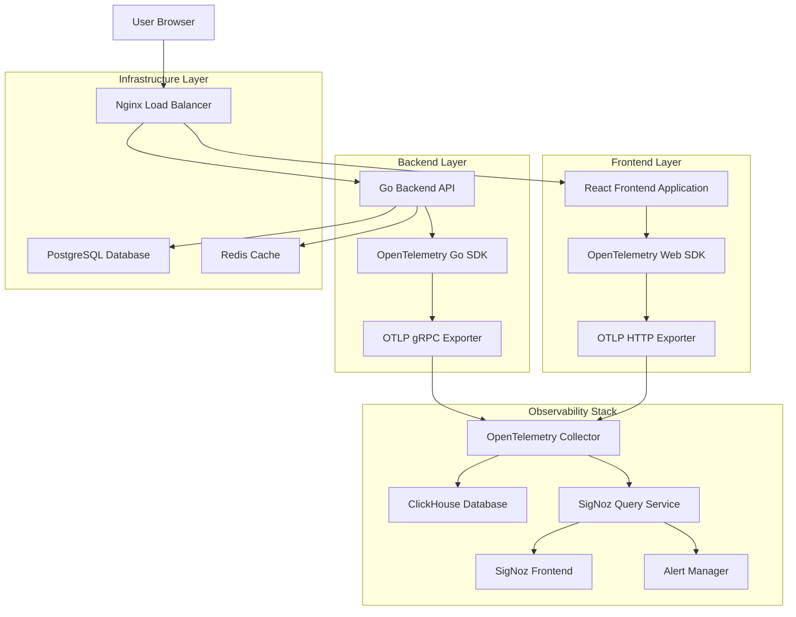
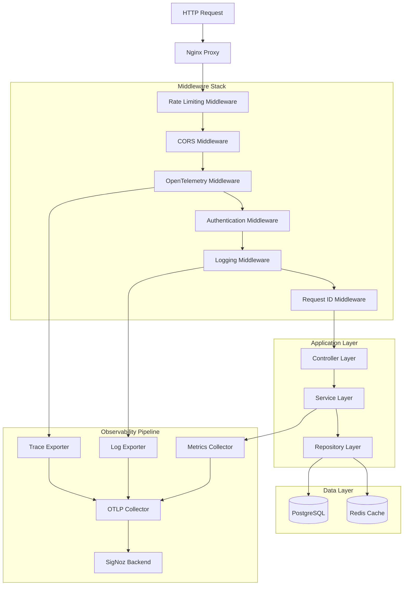
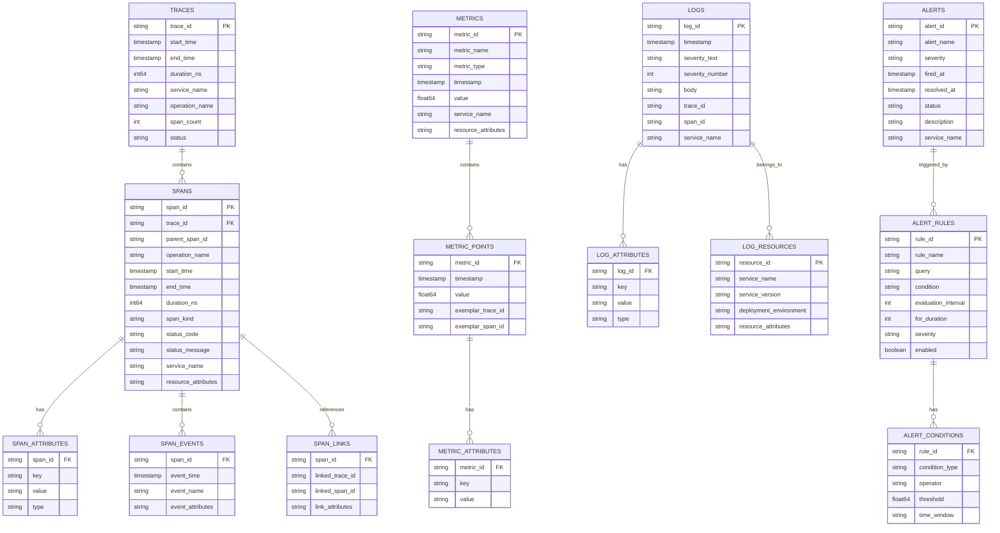

# OpenTelemetry & SigNoz Technical Architecture Document

## 1. Architecture Design



## 2. Technology Description

- **Frontend**: React\@18 + TypeScript + Vite + OpenTelemetry Web SDK

- **Backend**: Go\@1.21 + Gin + OpenTelemetry Go SDK

- **Infrastructure**: Docker + Nginx + PostgreSQL + Redis

- **Observability**: OpenTelemetry Collector + SigNoz + ClickHouse + AlertManager

- **Deployment**: Docker Compose + Environment-based configuration

## 3. Route Definitions

| Route                | Purpose                     | Instrumentation                 |
| -------------------- | --------------------------- | ------------------------------- |
| /                    | Frontend application root   | Browser RUM, page load metrics  |
| /dashboard           | Main dashboard page         | User interaction tracking       |
| /accounts            | Account management          | Form submission tracking        |
| /transactions        | Transaction history         | Data loading performance        |
| /reports             | Financial reports           | Chart rendering metrics         |
| /api/auth/\*         | Authentication endpoints    | Login/logout tracing            |
| /api/accounts/\*     | Account CRUD operations     | Database query tracing          |
| /api/transactions/\* | Transaction operations      | Business logic tracing          |
| /api/reports/\*      | Report generation           | Complex query performance       |
| /api/health          | Health check endpoint       | Service availability monitoring |
| /metrics             | Prometheus metrics endpoint | System metrics exposure         |

## 4. API Definitions

### 4.1 Telemetry Configuration API

**Initialize Telemetry**

```
POST /api/telemetry/init
```

Request:

| Param Name      | Param Type | isRequired | Description                               |
| --------------- | ---------- | ---------- | ----------------------------------------- |
| service_name    | string     | true       | Name of the service being instrumented    |
| service_version | string     | true       | Version of the service                    |
| environment     | string     | true       | Deployment environment (dev/staging/prod) |
| sampling_rate   | float      | false      | Trace sampling rate (0.0-1.0)             |

Response:

| Param Name       | Param Type | Description                   |
| ---------------- | ---------- | ----------------------------- |
| status           | boolean    | Initialization success status |
| trace_endpoint   | string     | OTLP trace endpoint URL       |
| metrics_endpoint | string     | OTLP metrics endpoint URL     |

Example:

```json
{
  "service_name": "finance-manager-backend",
  "service_version": "1.0.0",
  "environment": "production",
  "sampling_rate": 0.1
}
```

**Custom Metrics API**

```
POST /api/telemetry/metrics
```

Request:

| Param Name  | Param Type | isRequired | Description                       |
| ----------- | ---------- | ---------- | --------------------------------- |
| metric_name | string     | true       | Name of the custom metric         |
| metric_type | string     | true       | Type: counter, gauge, histogram   |
| value       | number     | true       | Metric value                      |
| labels      | object     | false      | Key-value pairs for metric labels |
| timestamp   | string     | false      | ISO timestamp (defaults to now)   |

Response:

| Param Name | Param Type | Description                               |
| ---------- | ---------- | ----------------------------------------- |
| status     | boolean    | Metric recording success                  |
| metric_id  | string     | Unique identifier for the recorded metric |

Example:

```json
{
  "metric_name": "transaction_amount",
  "metric_type": "histogram",
  "value": 150.75,
  "labels": {
    "transaction_type": "transfer",
    "account_type": "checking"
  }
}
```

**Trace Context API**

```
GET /api/telemetry/trace-context
```

Response:

| Param Name  | Param Type | Description                 |
| ----------- | ---------- | --------------------------- |
| trace_id    | string     | Current trace identifier    |
| span_id     | string     | Current span identifier     |
| trace_flags | string     | Trace sampling flags        |
| trace_state | string     | Vendor-specific trace state |

Example:

```json
{
  "trace_id": "4bf92f3577b34da6a3ce929d0e0e4736",
  "span_id": "00f067aa0ba902b7",
  "trace_flags": "01",
  "trace_state": "rojo=00f067aa0ba902b7,congo=t61rcWkgMzE"
}
```

### 4.2 Health Check API

**Service Health**

```
GET /api/health
```

Response:

| Param Name   | Param Type | Description                   |
| ------------ | ---------- | ----------------------------- |
| status       | string     | Overall service health status |
| version      | string     | Service version               |
| uptime       | number     | Service uptime in seconds     |
| dependencies | object     | Health status of dependencies |
| telemetry    | object     | Telemetry system status       |

Example:

```json
{
  "status": "healthy",
  "version": "1.0.0",
  "uptime": 3600,
  "dependencies": {
    "database": "healthy",
    "redis": "healthy",
    "otel_collector": "healthy"
  },
  "telemetry": {
    "traces_exported": 1250,
    "metrics_exported": 890,
    "last_export": "2024-01-15T10:30:00Z"
  }
}
```

## 5. Server Architecture Diagram



## 6. Data Model

### 6.1 Data Model Definition



### 6.2 Data Definition Language

**ClickHouse Tables for SigNoz**

```sql
-- Traces table
CREATE TABLE IF NOT EXISTS signoz_traces.signoz_index_v2 (
    timestamp DateTime64(9) CODEC(DoubleDelta, LZ4),
    traceID FixedString(32) CODEC(ZSTD(1)),
    spanID String CODEC(ZSTD(1)),
    parentSpanID String CODEC(ZSTD(1)),
    serviceName LowCardinality(String) CODEC(ZSTD(1)),
    name LowCardinality(String) CODEC(ZSTD(1)),
    kind Int8 CODEC(ZSTD(1)),
    durationNano UInt64 CODEC(ZSTD(1)),
    statusCode Int16 CODEC(ZSTD(1)),
    component LowCardinality(String) CODEC(ZSTD(1)),
    httpMethod LowCardinality(String) CODEC(ZSTD(1)),
    httpUrl String CODEC(ZSTD(1)),
    httpCode LowCardinality(String) CODEC(ZSTD(1)),
    httpRoute LowCardinality(String) CODEC(ZSTD(1)),
    httpHost LowCardinality(String) CODEC(ZSTD(1)),
    userID String CODEC(ZSTD(1)),
    customerID String CODEC(ZSTD(1)),
    errorID String CODEC(ZSTD(1)),
    errorType LowCardinality(String) CODEC(ZSTD(1)),
    errorMessage String CODEC(ZSTD(1)),
    hasError Bool CODEC(ZSTD(1)),
    rpcSystem LowCardinality(String) CODEC(ZSTD(1)),
    rpcService LowCardinality(String) CODEC(ZSTD(1)),
    rpcMethod LowCardinality(String) CODEC(ZSTD(1)),
    responseStatusCode LowCardinality(String) CODEC(ZSTD(1)),
    stringTagMap Map(LowCardinality(String), String) CODEC(ZSTD(1)),
    numberTagMap Map(LowCardinality(String), Float64) CODEC(ZSTD(1)),
    boolTagMap Map(LowCardinality(String), Bool) CODEC(ZSTD(1)),
    resourceTagsMap Map(LowCardinality(String), String) CODEC(ZSTD(1)),
    INDEX idx_service serviceName TYPE bloom_filter GRANULARITY 4,
    INDEX idx_name name TYPE bloom_filter GRANULARITY 4,
    INDEX idx_kind kind TYPE minmax GRANULARITY 4,
    INDEX idx_duration durationNano TYPE minmax GRANULARITY 1,
    INDEX idx_hasError hasError TYPE set(2) GRANULARITY 1
) ENGINE = MergeTree()
PARTITION BY toDate(timestamp)
ORDER BY (serviceName, name, toUnixTimestamp(timestamp), traceID)
TTL toDateTime(timestamp) + toIntervalDay(7)
SETTINGS index_granularity = 8192, ttl_only_drop_parts = 1;

-- Metrics table
CREATE TABLE IF NOT EXISTS signoz_metrics.samples_v2 (
    metric_name LowCardinality(String) CODEC(ZSTD(1)),
    fingerprint UInt64 CODEC(ZSTD(1)),
    timestamp_ms Int64 CODEC(DoubleDelta, ZSTD(1)),
    value Float64 CODEC(ZSTD(1)),
    labels String CODEC(ZSTD(1)),
    INDEX idx_metric_name metric_name TYPE bloom_filter GRANULARITY 4,
    INDEX idx_fingerprint fingerprint TYPE bloom_filter GRANULARITY 1
) ENGINE = MergeTree()
PARTITION BY toDate(timestamp_ms / 1000)
ORDER BY (metric_name, fingerprint, timestamp_ms)
TTL toDateTime(timestamp_ms / 1000) + toIntervalDay(30)
SETTINGS index_granularity = 8192, ttl_only_drop_parts = 1;

-- Logs table
CREATE TABLE IF NOT EXISTS signoz_logs.logs (
    timestamp UInt64 CODEC(DoubleDelta, ZSTD(1)),
    observed_timestamp UInt64 CODEC(DoubleDelta, ZSTD(1)),
    id String CODEC(ZSTD(1)),
    trace_id String CODEC(ZSTD(1)),
    span_id String CODEC(ZSTD(1)),
    trace_flags UInt32 CODEC(ZSTD(1)),
    severity_text LowCardinality(String) CODEC(ZSTD(1)),
    severity_number UInt8 CODEC(ZSTD(1)),
    body String CODEC(ZSTD(1)),
    resources_string_key Array(String) CODEC(ZSTD(1)),
    resources_string_value Array(String) CODEC(ZSTD(1)),
    attributes_string_key Array(String) CODEC(ZSTD(1)),
    attributes_string_value Array(String) CODEC(ZSTD(1)),
    attributes_number_key Array(String) CODEC(ZSTD(1)),
    attributes_number_value Array(Float64) CODEC(ZSTD(1)),
    attributes_bool_key Array(String) CODEC(ZSTD(1)),
    attributes_bool_value Array(Bool) CODEC(ZSTD(1)),
    INDEX idx_trace_id trace_id TYPE bloom_filter GRANULARITY 1,
    INDEX idx_span_id span_id TYPE bloom_filter GRANULARITY 1,
    INDEX idx_severity severity_number TYPE set(0) GRANULARITY 1
) ENGINE = MergeTree()
PARTITION BY toDate(timestamp / 1000000000)
ORDER BY (timestamp, id)
TTL toDateTime(timestamp / 1000000000) + toIntervalDay(7)
SETTINGS index_granularity = 8192, ttl_only_drop_parts = 1;

-- Create indexes for better query performance
CREATE INDEX idx_traces_service_time ON signoz_traces.signoz_index_v2 (serviceName, timestamp) TYPE minmax GRANULARITY 1;
CREATE INDEX idx_traces_operation_time ON signoz_traces.signoz_index_v2 (name, timestamp) TYPE minmax GRANULARITY 1;
CREATE INDEX idx_traces_duration ON signoz_traces.signoz_index_v2 (durationNano) TYPE minmax GRANULARITY 1;
CREATE INDEX idx_traces_error ON signoz_traces.signoz_index_v2 (hasError, timestamp) TYPE minmax GRANULARITY 1;

CREATE INDEX idx_metrics_name_time ON signoz_metrics.samples_v2 (metric_name, timestamp_ms) TYPE minmax GRANULARITY 1;
CREATE INDEX idx_metrics_fingerprint_time ON signoz_metrics.samples_v2 (fingerprint, timestamp_ms) TYPE minmax GRANULARITY 1;

CREATE INDEX idx_logs_timestamp ON signoz_logs.logs (timestamp) TYPE minmax GRANULARITY 1;
CREATE INDEX idx_logs_severity_time ON signoz_logs.logs (severity_number, timestamp) TYPE minmax GRANULARITY 1;
```

**PostgreSQL Tables for Application Data**

```sql
-- Telemetry configuration table
CREATE TABLE telemetry_config (
    id UUID PRIMARY KEY DEFAULT gen_random_uuid(),
    service_name VARCHAR(255) NOT NULL,
    service_version VARCHAR(100) NOT NULL,
    environment VARCHAR(50) NOT NULL,
    sampling_rate DECIMAL(3,2) DEFAULT 0.1,
    enabled BOOLEAN DEFAULT true,
    created_at TIMESTAMP WITH TIME ZONE DEFAULT NOW(),
    updated_at TIMESTAMP WITH TIME ZONE DEFAULT NOW()
);

-- Custom metrics definitions
CREATE TABLE custom_metrics (
    id UUID PRIMARY KEY DEFAULT gen_random_uuid(),
    metric_name VARCHAR(255) NOT NULL,
    metric_type VARCHAR(50) NOT NULL CHECK (metric_type IN ('counter', 'gauge', 'histogram')),
    description TEXT,
    unit VARCHAR(50),
    labels JSONB,
    service_name VARCHAR(255) NOT NULL,
    created_at TIMESTAMP WITH TIME ZONE DEFAULT NOW(),
    UNIQUE(metric_name, service_name)
);

-- Alert configurations
CREATE TABLE alert_rules (
    id UUID PRIMARY KEY DEFAULT gen_random_uuid(),
    rule_name VARCHAR(255) NOT NULL,
    description TEXT,
    query TEXT NOT NULL,
    condition_operator VARCHAR(20) NOT NULL CHECK (condition_operator IN ('>', '<', '>=', '<=', '==', '!=')),
    threshold DECIMAL(15,6) NOT NULL,
    evaluation_interval INTEGER DEFAULT 60, -- seconds
    for_duration INTEGER DEFAULT 300, -- seconds
    severity VARCHAR(20) DEFAULT 'warning' CHECK (severity IN ('info', 'warning', 'critical')),
    enabled BOOLEAN DEFAULT true,
    service_name VARCHAR(255),
    notification_channels JSONB,
    created_at TIMESTAMP WITH TIME ZONE DEFAULT NOW(),
    updated_at TIMESTAMP WITH TIME ZONE DEFAULT NOW()
);

-- Alert instances
CREATE TABLE alert_instances (
    id UUID PRIMARY KEY DEFAULT gen_random_uuid(),
    rule_id UUID NOT NULL REFERENCES alert_rules(id) ON DELETE CASCADE,
    alert_name VARCHAR(255) NOT NULL,
    severity VARCHAR(20) NOT NULL,
    status VARCHAR(20) DEFAULT 'firing' CHECK (status IN ('firing', 'resolved')),
    fired_at TIMESTAMP WITH TIME ZONE NOT NULL,
    resolved_at TIMESTAMP WITH TIME ZONE,
    description TEXT,
    labels JSONB,
    annotations JSONB,
    service_name VARCHAR(255),
    created_at TIMESTAMP WITH TIME ZONE DEFAULT NOW(),
    updated_at TIMESTAMP WITH TIME ZONE DEFAULT NOW()
);

-- Observability dashboard configurations
CREATE TABLE dashboards (
    id UUID PRIMARY KEY DEFAULT gen_random_uuid(),
    name VARCHAR(255) NOT NULL,
    description TEXT,
    dashboard_config JSONB NOT NULL,
    tags TEXT[],
    is_public BOOLEAN DEFAULT false,
    created_by UUID REFERENCES users(id),
    created_at TIMESTAMP WITH TIME ZONE DEFAULT NOW(),
    updated_at TIMESTAMP WITH TIME ZONE DEFAULT NOW()
);

-- Create indexes
CREATE INDEX idx_telemetry_config_service ON telemetry_config(service_name);
CREATE INDEX idx_telemetry_config_environment ON telemetry_config(environment);

CREATE INDEX idx_custom_metrics_service ON custom_metrics(service_name);
CREATE INDEX idx_custom_metrics_type ON custom_metrics(metric_type);
CREATE INDEX idx_custom_metrics_name ON custom_metrics(metric_name);

CREATE INDEX idx_alert_rules_service ON alert_rules(service_name);
CREATE INDEX idx_alert_rules_enabled ON alert_rules(enabled);
CREATE INDEX idx_alert_rules_severity ON alert_rules(severity);

CREATE INDEX idx_alert_instances_rule ON alert_instances(rule_id);
CREATE INDEX idx_alert_instances_status ON alert_instances(status);
CREATE INDEX idx_alert_instances_fired_at ON alert_instances(fired_at DESC);
CREATE INDEX idx_alert_instances_service ON alert_instances(service_name);

CREATE INDEX idx_dashboards_created_by ON dashboards(created_by);
CREATE INDEX idx_dashboards_tags ON dashboards USING GIN(tags);
CREATE INDEX idx_dashboards_public ON dashboards(is_public);

-- Insert initial configuration
INSERT INTO telemetry_config (service_name, service_version, environment, sampling_rate) VALUES
('finance-manager-backend', '1.0.0', 'development', 1.0),
('finance-manager-backend', '1.0.0', 'staging', 0.5),
('finance-manager-backend', '1.0.0', 'production', 0.1),
('finance-manager-frontend', '1.0.0', 'development', 1.0),
('finance-manager-frontend', '1.0.0', 'staging', 0.3),
('finance-manager-frontend', '1.0.0', 'production', 0.05);

-- Insert default custom metrics
INSERT INTO custom_metrics (metric_name, metric_type, description, unit, service_name) VALUES
('user_registrations_total', 'counter', 'Total number of user registrations', 'count', 'finance-manager-backend'),
('user_logins_total', 'counter', 'Total number of user logins', 'count', 'finance-manager-backend'),
('active_users', 'gauge', 'Number of currently active users', 'count', 'finance-manager-backend'),
('transactions_total', 'counter', 'Total number of transactions', 'count', 'finance-manager-backend'),
('transaction_amount', 'histogram', 'Transaction amounts', 'USD', 'finance-manager-backend'),
('account_balance', 'gauge', 'Current account balance', 'USD', 'finance-manager-backend'),
('database_connections', 'gauge', 'Number of active database connections', 'count', 'finance-manager-backend'),
('cache_hit_rate', 'gauge', 'Cache hit rate percentage', 'percent', 'finance-manager-backend'),
('api_response_time', 'histogram', 'API response time', 'milliseconds', 'finance-manager-backend'),
('page_load_time', 'histogram', 'Page load time', 'milliseconds', 'finance-manager-frontend'),
('user_interactions_total', 'counter', 'Total user interactions', 'count', 'finance-manager-frontend');

-- Insert default alert rules
INSERT INTO alert_rules (rule_name, description, query, condition_operator, threshold, severity, service_name) VALUES
('High Error Rate', 'Alert when error rate exceeds 5%', 'sum(rate(http_requests_total{status_code=~"5.."}[5m])) / sum(rate(http_requests_total[5m]))', '>', 0.05, 'warning', 'finance-manager-backend'),
('High Response Time', 'Alert when 95th percentile response time exceeds 1 second', 'histogram_quantile(0.95, sum(rate(http_request_duration_seconds_bucket[5m])) by (le))', '>', 1.0, 'warning', 'finance-manager-backend'),
('Database Connection High', 'Alert when database connections exceed 80', 'database_connections', '>', 80, 'warning', 'finance-manager-backend'),
('Low Cache Hit Rate', 'Alert when cache hit rate falls below 70%', 'cache_hit_rate', '<', 70, 'warning', 'finance-manager-backend'),
('High Transaction Failure Rate', 'Alert when transaction failure rate exceeds 2%', 'sum(rate(transactions_total{status="failed"}[5m])) / sum(rate(transactions_total[5m]))', '>', 0.02, 'critical', 'finance-manager-backend'),
('Service Down', 'Alert when service is down', 'up', '==', 0, 'critical', 'finance-manager-backend');
```

## 7. Deployment Configuration

### 7.1 Docker Compose Override

```yaml
# docker-compose.observability.override.yml
version: "3.8"

services:
  backend:
    environment:
      - OTEL_EXPORTER_OTLP_ENDPOINT=http://otel-collector:4317
      - OTEL_EXPORTER_OTLP_INSECURE=true
      - OTEL_SERVICE_NAME=finance-manager-backend
      - OTEL_SERVICE_VERSION=1.0.0
      - OTEL_RESOURCE_ATTRIBUTES=service.namespace=finance-manager,deployment.environment=${ENVIRONMENT:-development}
    depends_on:
      - otel-collector
    networks:
      - observability

  frontend:
    environment:
      - VITE_OTEL_ENDPOINT=http://localhost:4318
      - VITE_OTEL_SERVICE_NAME=finance-manager-frontend
      - VITE_OTEL_SERVICE_VERSION=1.0.0
      - VITE_ENVIRONMENT=${ENVIRONMENT:-development}
    depends_on:
      - otel-collector
    networks:
      - observability

  nginx:
    volumes:
      - ./nginx/nginx-otel.conf:/etc/nginx/nginx.conf:ro
      - ./nginx/jaeger-config.json:/etc/nginx/jaeger-config.json:ro
    depends_on:
      - otel-collector
    networks:
      - observability

  # OpenTelemetry Collector
  otel-collector:
    image: otel/opentelemetry-collector-contrib:0.88.0
    container_name: otel-collector
    command: ["--config=/etc/otel-collector-config.yaml"]
    volumes:
      - ./otel/otel-collector-config.yaml:/etc/otel-collector-config.yaml:ro
    ports:
      - "1888:1888" # pprof extension
      - "8888:8888" # Prometheus metrics
      - "8889:8889" # Prometheus exporter metrics
      - "13133:13133" # health_check extension
      - "4317:4317" # OTLP gRPC receiver
      - "4318:4318" # OTLP HTTP receiver
      - "55679:55679" # zpages extension
    depends_on:
      - clickhouse
    networks:
      - observability
    restart: unless-stopped
    healthcheck:
      test: ["CMD", "wget", "--spider", "-q", "localhost:13133"]
      interval: 30s
      timeout: 5s
      retries: 3

  # ClickHouse for SigNoz
  clickhouse:
    image: clickhouse/clickhouse-server:22.8-alpine
    container_name: signoz-clickhouse
    hostname: clickhouse
    ports:
      - "9000:9000"
      - "8123:8123"
      - "9181:9181"
    volumes:
      - ./clickhouse/clickhouse-config.xml:/etc/clickhouse-server/config.xml:ro
      - ./clickhouse/clickhouse-users.xml:/etc/clickhouse-server/users.xml:ro
      - ./clickhouse/custom-function.xml:/etc/clickhouse-server/custom-function.xml:ro
      - ./clickhouse/clickhouse-cluster.xml:/etc/clickhouse-server/config.d/cluster.xml:ro
      - clickhouse-data:/var/lib/clickhouse/
    environment:
      - CLICKHOUSE_DB=signoz_traces
      - CLICKHOUSE_USER=signoz
      - CLICKHOUSE_PASSWORD=signoz
    networks:
      - observability
    restart: unless-stopped
    healthcheck:
      test: ["CMD", "wget", "--spider", "-q", "localhost:8123/ping"]
      interval: 30s
      timeout: 5s
      retries: 3

  # SigNoz Query Service
  query-service:
    image: signoz/signoz:0.39.0
    container_name: signoz-query-service
    command: ["-config=/root/config/prometheus.yml"]
    volumes:
      - ./signoz/prometheus.yml:/root/config/prometheus.yml:ro
      - ./dashboards:/root/config/dashboards:ro
      - signoz-data:/var/lib/signoz/
    environment:
      - ClickHouseUrl=tcp://clickhouse:9000
      - ALERTMANAGER_API_PREFIX=http://alertmanager:9093/api/v1
      - SIGNOZ_LOCAL_DB_PATH=/var/lib/signoz/signoz.db
      - DASHBOARDS_PATH=/root/config/dashboards
      - STORAGE=clickhouse
      - GODEBUG=netdns=go
      - TELEMETRY_ENABLED=true
      - DEPLOYMENT_TYPE=docker-standalone-amd
    ports:
      - "8080:8080"
    networks:
      - observability
    restart: unless-stopped
    healthcheck:
      test: ["CMD", "wget", "--spider", "-q", "localhost:8080/api/v1/health"]
      interval: 30s
      timeout: 5s
      retries: 3
    depends_on:
      clickhouse:
        condition: service_healthy
      otel-collector:
        condition: service_healthy

  # SigNoz Frontend
  signoz-frontend:
    image: signoz/signoz-frontend:0.39.0
    container_name: signoz-frontend
    ports:
      - "3301:3301"
    volumes:
      - ./nginx/signoz-nginx.conf:/etc/nginx/conf.d/default.conf:ro
    networks:
      - observability
    restart: unless-stopped
    depends_on:
      - alertmanager
      - query-service

  # Alert Manager
  alertmanager:
    image: signoz/alertmanager:0.23.5
    container_name: signoz-alertmanager
    volumes:
      - ./alertmanager/config.yml:/etc/alertmanager/config.yml:ro
      - ./alertmanager/rules.yml:/etc/alertmanager/rules.yml:ro
    command:
      - --queryURL=http://query-service:8080
      - --rules=/etc/alertmanager/rules.yml
    ports:
      - "9093:9093"
    networks:
      - observability
    restart: unless-stopped
    healthcheck:
      test: ["CMD", "wget", "--spider", "-q", "localhost:9093/-/healthy"]
      interval: 30s
      timeout: 5s
      retries: 3
    depends_on:
      query-service:
        condition: service_healthy

volumes:
  clickhouse-data:
    driver: local
  signoz-data:
    driver: local

networks:
  observability:
    driver: bridge
    ipam:
      config:
        - subnet: 172.20.0.0/16
```

### 7.2 Environment Configuration

```bash
# .env.observability
# OpenTelemetry Configuration
OTEL_EXPORTER_OTLP_ENDPOINT=http://localhost:4317
OTEL_EXPORTER_OTLP_INSECURE=true
OTEL_SERVICE_NAME=finance-manager
OTEL_SERVICE_VERSION=1.0.0
OTEL_RESOURCE_ATTRIBUTES=service.namespace=finance-manager,deployment.environment=development

# SigNoz Configuration
SIGNOZ_ENDPOINT=http://localhost:3301
SIGNOZ_API_KEY=
SIGNOZ_ORGANIZATION_ID=

# ClickHouse Configuration
CLICKHOUSE_HOST=localhost
CLICKHOUSE_PORT=9000
CLICKHOUSE_USER=signoz
CLICKHOUSE_PASSWORD=signoz
CLICKHOUSE_DATABASE=signoz_traces

# Alert Manager Configuration
ALERTMANAGER_ENDPOINT=http://localhost:9093
SMTP_HOST=localhost
SMTP_PORT=587
SMTP_USER=alerts@finance-manager.com
SMTP_PASSWORD=
SLACK_WEBHOOK
```
