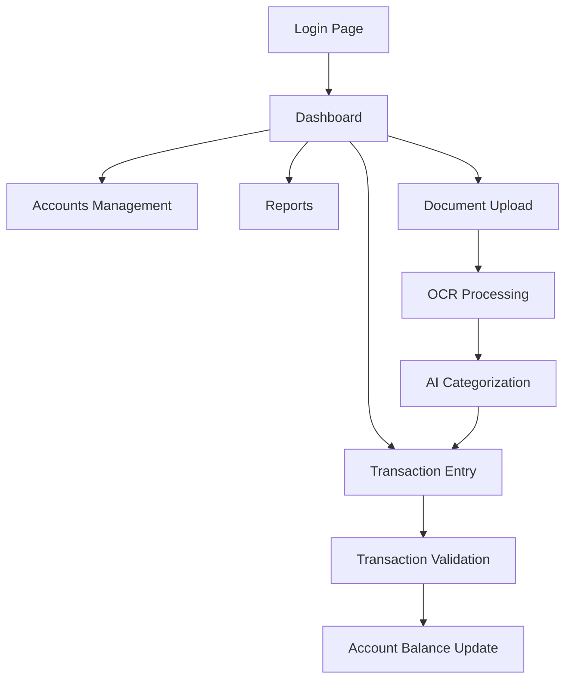

# Finance Manager Refactoring Plan

## 1. Project Overview

This document outlines the comprehensive refactoring plan for migrating the Finance Manager project from its current Node.js/Astro/Cloudflare Workers architecture to a containerized Go backend with Digital Ocean deployment.

**Current Architecture:**
- Frontend: Astro with React islands
- Backend: Cloudflare Workers with Hono framework
- Database: Cloudflare D1 (SQLite)
- Storage: Cloudflare R2, KV
- Package Manager: pnpm
- Deployment: Cloudflare Workers

**Target Architecture:**
- Frontend: React SPA
- Backend: Go with Gin/Echo framework
- Database: PostgreSQL in Docker
- Cache: Redis in Docker
- Package Manager: Bun
- Containerization: Docker with Docker Compose
- Reverse Proxy: Nginx
- Deployment: Digital Ocean Droplet

## 2. Core Features

### 2.1 Feature Module
The refactored application will maintain all existing functionality:

1. **Authentication System**: JWT-based authentication with magic link support
2. **Financial Management**: Double-entry bookkeeping, chart of accounts, transactions
3. **AI-Powered Features**: Document OCR, smart categorization, financial analysis
4. **Reporting System**: Financial statements, multi-format exports (PDF, Excel, CSV)
5. **Dashboard**: Real-time financial overview and analytics
6. **Document Management**: Receipt and invoice processing with AI extraction

### 2.2 Page Details

| Page Name | Module Name | Feature Description |
|-----------|-------------|--------------------|
| Login | Authentication | JWT login, magic link authentication, password reset |
| Dashboard | Financial Overview | Real-time balance display, recent transactions, AI insights |
| Accounts | Chart of Accounts | Hierarchical account management, account creation/editing |
| Transactions | Transaction Management | Double-entry transaction recording, journal entries, validation |
| Reports | Financial Reporting | Balance sheet, P&L, cash flow statements with export options |
| Documents | Document Processing | OCR processing, AI categorization, document search |
| Budget | Budget Management | Budget creation, tracking, variance analysis |

## 3. Core Process

**User Authentication Flow:**
1. User accesses login page
2. Enters email for magic link or credentials
3. System validates and creates JWT session
4. User redirected to dashboard

**Transaction Processing Flow:**
1. User navigates to transaction page
2. Creates new transaction with debit/credit entries
3. System validates double-entry rules
4. Transaction saved and account balances updated
5. Real-time dashboard updates

**Document Processing Flow:**
1. User uploads receipt/invoice
2. Go backend processes with OCR service
3. AI categorizes and extracts data
4. User reviews and confirms transaction
5. Transaction automatically created



## 4. User Interface Design

### 4.1 Design Style
- **Primary Colors**: Blue (#3B82F6), Green (#10B981) for positive values
- **Secondary Colors**: Gray (#6B7280), Red (#EF4444) for negative values
- **Button Style**: Rounded corners with subtle shadows
- **Font**: Inter or system fonts, 14px base size
- **Layout**: Clean card-based design with sidebar navigation
- **Icons**: Lucide React icon set

### 4.2 Page Design Overview

| Page Name | Module Name | UI Elements |
|-----------|-------------|-------------|
| Dashboard | Main Layout | Sidebar navigation, metric cards, chart widgets, recent activity list |
| Transactions | Data Table | Sortable table, filter controls, modal forms, pagination |
| Reports | Report Viewer | Date pickers, export buttons, chart visualizations, print layouts |
| Documents | File Manager | Drag-drop upload, thumbnail grid, search bar, processing status |

### 4.3 Responsiveness
The application will be desktop-first with mobile-responsive design, optimized for touch interactions on tablets and phones.

## 5. Migration Strategy

### 5.1 Phase 1: Infrastructure Setup
1. **Docker Environment Setup**
   - Create Docker Compose configuration
   - Set up PostgreSQL container with persistent volumes
   - Configure Redis container for caching
   - Set up Nginx reverse proxy

2. **Go Backend Foundation**
   - Initialize Go module with Gin/Echo framework
   - Set up project structure and routing
   - Implement database connection with GORM/sqlx
   - Create middleware for CORS, logging, authentication

### 5.2 Phase 2: Database Migration
1. **Schema Translation**
   - Convert Drizzle schema to PostgreSQL DDL
   - Migrate existing D1 data to PostgreSQL
   - Set up database migrations system
   - Implement connection pooling

2. **Data Layer Implementation**
   - Create Go models matching existing schema
   - Implement repository pattern for data access
   - Add database transaction support
   - Set up Redis caching layer

### 5.3 Phase 3: API Migration
1. **Core API Endpoints**
   - Authentication endpoints (login, register, magic link)
   - Account management APIs
   - Transaction CRUD operations
   - Financial reporting endpoints

2. **AI Service Integration**
   - OCR service integration
   - Document processing pipeline
   - AI categorization service
   - Vector search implementation

### 5.4 Phase 4: Frontend Refactoring
1. **React SPA Setup**
   - Convert Astro pages to React components
   - Set up React Router for navigation
   - Implement state management (Zustand/Redux)
   - Configure API client with authentication

2. **Package Manager Migration**
   - Convert package.json for Bun compatibility
   - Update build scripts and configurations
   - Migrate from pnpm to Bun workflows
   - Update CI/CD pipelines

### 5.5 Phase 5: Deployment & DevOps
1. **Digital Ocean Setup**
   - Provision droplet with Docker support
   - Configure domain and SSL certificates
   - Set up monitoring and logging
   - Implement backup strategies

2. **CI/CD Pipeline**
   - Update GitHub Actions for Docker builds
   - Implement automated testing in containers
   - Set up deployment automation
   - Configure environment management

## 6. File Consolidation Strategy

### 6.1 Files to Remove
- All Cloudflare-specific configurations (wrangler.jsonc, alchemy.*.ts)
- Astro configuration and build files
- pnpm-specific files (pnpm-lock.yaml, pnpm-workspace.yaml)
- Cloudflare Workers test configurations
- Legacy agent configuration directories (.clinerules, .cursor, .roo, etc.)

### 6.2 Files to Consolidate
- Merge multiple test configurations into unified Docker-based testing
- Consolidate documentation from various agent folders into single docs directory
- Combine environment configurations into Docker Compose files
- Merge linting configurations into single oxlint setup

### 6.3 New File Structure
```
.
├── backend/                 # Go backend application
│   ├── cmd/                 # Application entry points
│   ├── internal/            # Private application code
│   ├── pkg/                 # Public packages
│   ├── migrations/          # Database migrations
│   └── Dockerfile
├── frontend/                # React frontend application
│   ├── src/
│   ├── public/
│   ├── package.json
│   └── Dockerfile
├── docker-compose.yml       # Multi-container orchestration
├── nginx/                   # Nginx configuration
├── docs/                    # Consolidated documentation
├── scripts/                 # Deployment and utility scripts
└── .github/workflows/       # Updated CI/CD pipelines
```

## 7. Risk Mitigation

### 7.1 Data Migration Risks
- **Risk**: Data loss during D1 to PostgreSQL migration
- **Mitigation**: Comprehensive backup strategy, staged migration with validation

### 7.2 Service Compatibility
- **Risk**: AI service integration changes
- **Mitigation**: Abstraction layer for AI providers, fallback mechanisms

### 7.3 Performance Impact
- **Risk**: Latency increase from Cloudflare Edge to single droplet
- **Mitigation**: Redis caching, CDN for static assets, database optimization

### 7.4 Deployment Complexity
- **Risk**: Docker orchestration complexity
- **Mitigation**: Comprehensive documentation, automated deployment scripts, monitoring

## 8. Timeline Estimate

- **Phase 1 (Infrastructure)**: 1-2 weeks
- **Phase 2 (Database)**: 2-3 weeks
- **Phase 3 (API Migration)**: 3-4 weeks
- **Phase 4 (Frontend)**: 2-3 weeks
- **Phase 5 (Deployment)**: 1-2 weeks
- **Testing & Optimization**: 1-2 weeks

**Total Estimated Duration**: 10-16 weeks

## 9. Success Criteria

1. **Functional Parity**: All existing features working in new architecture
2. **Performance**: Response times within 200ms for API calls
3. **Reliability**: 99.9% uptime with proper monitoring
4. **Maintainability**: Clean code structure with comprehensive documentation
5. **Scalability**: Ability to handle 10x current load with horizontal scaling
