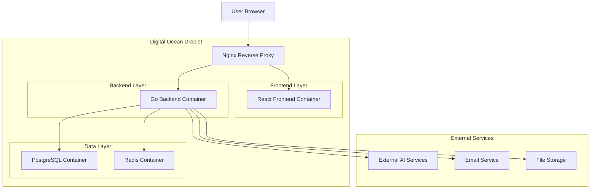
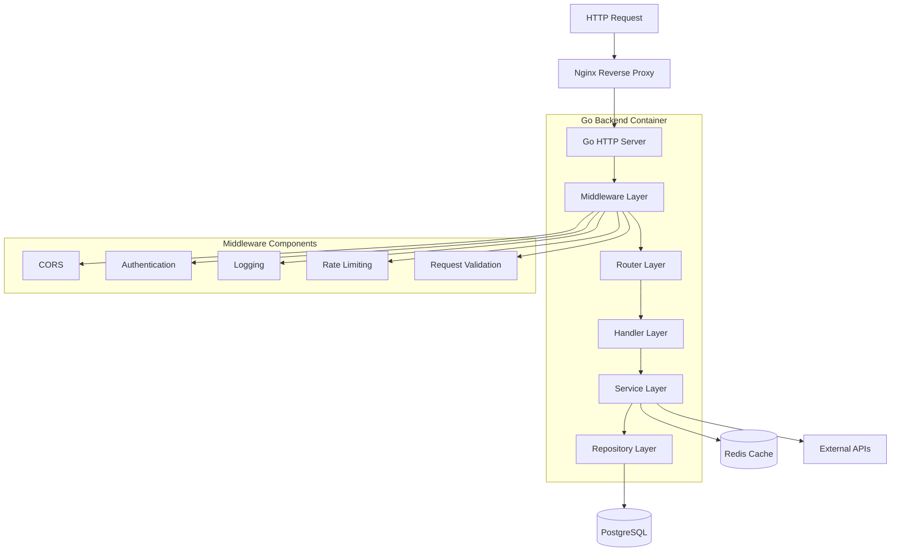
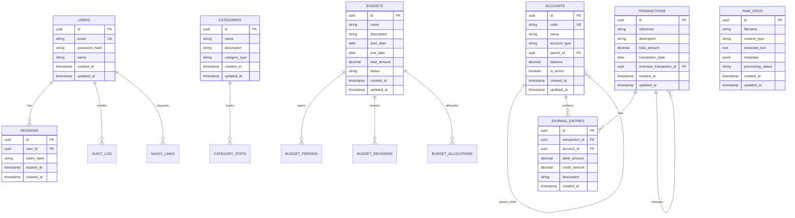

# Finance Manager Technical Architecture

## 1. Architecture Design



## 2. Technology Description

- **Frontend**: React@18 + TypeScript + Vite + TailwindCSS
- **Backend**: Go@1.21 + Gin Framework + GORM
- **Database**: PostgreSQL@15 in Docker container
- **Cache**: Redis@7 in Docker container
- **Reverse Proxy**: Nginx@1.25
- **Containerization**: Docker + Docker Compose
- **Package Manager**: Bun@1.0+
- **Linting**: oxlint
- **Deployment**: Digital Ocean Droplet

## 3. Route Definitions

| Route         | Purpose                                  |
| ------------- | ---------------------------------------- |
| /             | React SPA entry point, serves index.html |
| /login        | Authentication page                      |
| /dashboard    | Main dashboard with financial overview   |
| /accounts     | Chart of accounts management             |
| /transactions | Transaction entry and management         |
| /reports      | Financial reports and statements         |
| /documents    | Document upload and processing           |
| /budget       | Budget management and tracking           |
| /api/\*       | Backend API endpoints (proxied by Nginx) |

## 4. API Definitions

### 4.1 Core API

**Authentication Endpoints**

```
POST /api/auth/login
POST /api/auth/register
POST /api/auth/magic-link
POST /api/auth/verify-magic-link
POST /api/auth/refresh
POST /api/auth/logout
```

**User Authentication**

```
POST /api/auth/login
```

Request:
| Param Name | Param Type | isRequired | Description |
|------------|------------|------------|-------------|
| email | string | true | User email address |
| password | string | false | Password (optional for magic link) |
| magic_token | string | false | Magic link token |

Response:
| Param Name | Param Type | Description |
|------------|------------|-------------|
| success | boolean | Authentication status |
| token | string | JWT access token |
| refresh_token | string | JWT refresh token |
| user | object | User profile data |

Example Request:

```json
{
  "email": "user@example.com",
  "password": "securepassword123"
}
```

Example Response:

```json
{
  "success": true,
  "token": "eyJhbGciOiJIUzI1NiIsInR5cCI6IkpXVCJ9...",
  "refresh_token": "eyJhbGciOiJIUzI1NiIsInR5cCI6IkpXVCJ9...",
  "user": {
    "id": "uuid-here",
    "email": "user@example.com",
    "name": "John Doe"
  }
}
```

**Account Management**

```
GET /api/accounts
POST /api/accounts
PUT /api/accounts/:id
DELETE /api/accounts/:id
GET /api/accounts/:id/balance
```

**Transaction Management**

```
GET /api/transactions
POST /api/transactions
PUT /api/transactions/:id
DELETE /api/transactions/:id
GET /api/transactions/:id/journal-entries
```

**Financial Reports**

```
GET /api/reports/balance-sheet
GET /api/reports/income-statement
GET /api/reports/cash-flow
POST /api/reports/export
```

**Document Processing**

```
POST /api/documents/upload
GET /api/documents
POST /api/documents/:id/process
GET /api/documents/:id/ocr-result
```

### 4.2 AI Integration APIs

**OCR Processing**

```
POST /api/ai/ocr
```

Request:
| Param Name | Param Type | isRequired | Description |
|------------|------------|------------|-------------|
| file | multipart/form-data | true | Image or PDF file |
| document_type | string | false | receipt, invoice, statement |

Response:
| Param Name | Param Type | Description |
|------------|------------|-------------|
| success | boolean | Processing status |
| extracted_text | string | Raw OCR text |
| structured_data | object | Parsed financial data |
| confidence | float | OCR confidence score |

**Smart Categorization**

```
POST /api/ai/categorize
```

Request:
| Param Name | Param Type | isRequired | Description |
|------------|------------|------------|-------------|
| description | string | true | Transaction description |
| amount | number | true | Transaction amount |
| merchant | string | false | Merchant name |

Response:
| Param Name | Param Type | Description |
|------------|------------|-------------|
| category | string | Suggested category |
| account_id | string | Suggested account ID |
| confidence | float | Categorization confidence |
| reasoning | string | AI reasoning explanation |

## 5. Server Architecture Diagram



## 6. Data Model

### 6.1 Data Model Definition



### 6.2 Data Definition Language

**Users Table**

```sql
-- Create users table
CREATE TABLE users (
    id UUID PRIMARY KEY DEFAULT gen_random_uuid(),
    email VARCHAR(255) UNIQUE NOT NULL,
    password_hash VARCHAR(255),
    name VARCHAR(100) NOT NULL,
    created_at TIMESTAMP WITH TIME ZONE DEFAULT NOW(),
    updated_at TIMESTAMP WITH TIME ZONE DEFAULT NOW()
);

-- Create indexes
CREATE INDEX idx_users_email ON users(email);
CREATE INDEX idx_users_created_at ON users(created_at DESC);
```

**Sessions Table**

```sql
-- Create sessions table
CREATE TABLE sessions (
    id UUID PRIMARY KEY DEFAULT gen_random_uuid(),
    user_id UUID NOT NULL REFERENCES users(id) ON DELETE CASCADE,
    token_hash VARCHAR(255) NOT NULL,
    expires_at TIMESTAMP WITH TIME ZONE NOT NULL,
    created_at TIMESTAMP WITH TIME ZONE DEFAULT NOW()
);

-- Create indexes
CREATE INDEX idx_sessions_user_id ON sessions(user_id);
CREATE INDEX idx_sessions_token_hash ON sessions(token_hash);
CREATE INDEX idx_sessions_expires_at ON sessions(expires_at);
```

**Accounts Table**

```sql
-- Create accounts table
CREATE TABLE accounts (
    id UUID PRIMARY KEY DEFAULT gen_random_uuid(),
    code VARCHAR(20) UNIQUE NOT NULL,
    name VARCHAR(255) NOT NULL,
    account_type VARCHAR(50) NOT NULL CHECK (account_type IN ('asset', 'liability', 'equity', 'revenue', 'expense')),
    parent_id UUID REFERENCES accounts(id),
    balance DECIMAL(15,2) DEFAULT 0.00,
    is_active BOOLEAN DEFAULT true,
    created_at TIMESTAMP WITH TIME ZONE DEFAULT NOW(),
    updated_at TIMESTAMP WITH TIME ZONE DEFAULT NOW()
);

-- Create indexes
CREATE INDEX idx_accounts_code ON accounts(code);
CREATE INDEX idx_accounts_type ON accounts(account_type);
CREATE INDEX idx_accounts_parent_id ON accounts(parent_id);
CREATE INDEX idx_accounts_active ON accounts(is_active);
```

**Transactions Table**

```sql
-- Create transactions table
CREATE TABLE transactions (
    id UUID PRIMARY KEY DEFAULT gen_random_uuid(),
    reference VARCHAR(50) UNIQUE NOT NULL,
    description TEXT NOT NULL,
    total_amount DECIMAL(15,2) NOT NULL,
    transaction_date DATE NOT NULL,
    reversed_transaction_id UUID REFERENCES transactions(id),
    created_at TIMESTAMP WITH TIME ZONE DEFAULT NOW(),
    updated_at TIMESTAMP WITH TIME ZONE DEFAULT NOW()
);

-- Create indexes
CREATE INDEX idx_transactions_reference ON transactions(reference);
CREATE INDEX idx_transactions_date ON transactions(transaction_date DESC);
CREATE INDEX idx_transactions_amount ON transactions(total_amount);
CREATE INDEX idx_transactions_created_at ON transactions(created_at DESC);
```

**Journal Entries Table**

```sql
-- Create journal_entries table
CREATE TABLE journal_entries (
    id UUID PRIMARY KEY DEFAULT gen_random_uuid(),
    transaction_id UUID NOT NULL REFERENCES transactions(id) ON DELETE CASCADE,
    account_id UUID NOT NULL REFERENCES accounts(id),
    debit_amount DECIMAL(15,2) DEFAULT 0.00,
    credit_amount DECIMAL(15,2) DEFAULT 0.00,
    description TEXT,
    created_at TIMESTAMP WITH TIME ZONE DEFAULT NOW(),
    CONSTRAINT check_debit_or_credit CHECK (
        (debit_amount > 0 AND credit_amount = 0) OR
        (credit_amount > 0 AND debit_amount = 0)
    )
);

-- Create indexes
CREATE INDEX idx_journal_entries_transaction_id ON journal_entries(transaction_id);
CREATE INDEX idx_journal_entries_account_id ON journal_entries(account_id);
CREATE INDEX idx_journal_entries_created_at ON journal_entries(created_at DESC);
```

**Categories Table**

```sql
-- Create categories table
CREATE TABLE categories (
    id UUID PRIMARY KEY DEFAULT gen_random_uuid(),
    name VARCHAR(100) NOT NULL,
    description TEXT,
    category_type VARCHAR(50) NOT NULL,
    created_at TIMESTAMP WITH TIME ZONE DEFAULT NOW(),
    updated_at TIMESTAMP WITH TIME ZONE DEFAULT NOW()
);

-- Create indexes
CREATE INDEX idx_categories_name ON categories(name);
CREATE INDEX idx_categories_type ON categories(category_type);
```

**Raw Documents Table**

```sql
-- Create raw_docs table
CREATE TABLE raw_docs (
    id UUID PRIMARY KEY DEFAULT gen_random_uuid(),
    filename VARCHAR(255) NOT NULL,
    content_type VARCHAR(100) NOT NULL,
    extracted_text TEXT,
    metadata JSONB,
    processing_status VARCHAR(50) DEFAULT 'pending',
    created_at TIMESTAMP WITH TIME ZONE DEFAULT NOW(),
    updated_at TIMESTAMP WITH TIME ZONE DEFAULT NOW()
);

-- Create indexes
CREATE INDEX idx_raw_docs_filename ON raw_docs(filename);
CREATE INDEX idx_raw_docs_status ON raw_docs(processing_status);
CREATE INDEX idx_raw_docs_created_at ON raw_docs(created_at DESC);
CREATE INDEX idx_raw_docs_metadata ON raw_docs USING GIN(metadata);
```

**Initial Data**

```sql
-- Insert default account types
INSERT INTO accounts (code, name, account_type) VALUES
('1000', 'Assets', 'asset'),
('2000', 'Liabilities', 'liability'),
('3000', 'Equity', 'equity'),
('4000', 'Revenue', 'revenue'),
('5000', 'Expenses', 'expense');

-- Insert default categories
INSERT INTO categories (name, description, category_type) VALUES
('Office Supplies', 'General office supplies and materials', 'expense'),
('Travel', 'Business travel and transportation', 'expense'),
('Meals & Entertainment', 'Business meals and entertainment', 'expense'),
('Software & Subscriptions', 'Software licenses and subscriptions', 'expense'),
('Professional Services', 'Legal, accounting, and consulting services', 'expense');
```

## 7. Docker Configuration

### 7.1 Docker Compose Setup

```yaml
# docker-compose.yml
version: "3.8"

services:
  nginx:
    image: nginx:1.25-alpine
    ports:
      - "80:80"
      - "443:443"
    volumes:
      - ./nginx/nginx.conf:/etc/nginx/nginx.conf
      - ./nginx/ssl:/etc/nginx/ssl
    depends_on:
      - frontend
      - backend
    networks:
      - finance-network

  frontend:
    build:
      context: ./frontend
      dockerfile: Dockerfile
    environment:
      - VITE_API_URL=http://backend:8080
    networks:
      - finance-network

  backend:
    build:
      context: ./backend
      dockerfile: Dockerfile
    environment:
      - DB_HOST=postgres
      - DB_PORT=5432
      - DB_NAME=finance_manager
      - DB_USER=finance_user
      - DB_PASSWORD=secure_password
      - REDIS_URL=redis:6379
      - JWT_SECRET=your-jwt-secret
    depends_on:
      - postgres
      - redis
    networks:
      - finance-network

  postgres:
    image: postgres:15-alpine
    environment:
      - POSTGRES_DB=finance_manager
      - POSTGRES_USER=finance_user
      - POSTGRES_PASSWORD=secure_password
    volumes:
      - postgres_data:/var/lib/postgresql/data
      - ./backend/migrations:/docker-entrypoint-initdb.d
    networks:
      - finance-network

  redis:
    image: redis:7-alpine
    command: redis-server --appendonly yes
    volumes:
      - redis_data:/data
    networks:
      - finance-network

volumes:
  postgres_data:
  redis_data:

networks:
  finance-network:
    driver: bridge
```

### 7.2 Environment Configuration

**Backend Environment Variables**

```env
# Database
DB_HOST=postgres
DB_PORT=5432
DB_NAME=finance_manager
DB_USER=finance_user
DB_PASSWORD=secure_password
DB_SSL_MODE=disable

# Redis
REDIS_URL=redis:6379
REDIS_PASSWORD=

# JWT
JWT_SECRET=your-super-secure-jwt-secret
JWT_EXPIRY=24h
JWT_REFRESH_EXPIRY=168h

# AI Services
OPENROUTER_API_KEY=your-openrouter-key
OCR_SERVICE_URL=https://api.ocr-service.com

# Email
SMTP_HOST=smtp.gmail.com
SMTP_PORT=587
SMTP_USER=your-email@gmail.com
SMTP_PASSWORD=your-app-password

# Application
APP_ENV=production
APP_PORT=8080
APP_DEBUG=false
```

## 8. Deployment Strategy

### 8.1 Digital Ocean Droplet Setup

1. **Droplet Specifications**

   - Size: 2 vCPUs, 4GB RAM, 80GB SSD
   - OS: Ubuntu 22.04 LTS
   - Docker and Docker Compose pre-installed

2. **Security Configuration**

   - SSH key authentication only
   - UFW firewall with ports 22, 80, 443 open
   - Automatic security updates enabled
   - Fail2ban for intrusion prevention

3. **SSL/TLS Setup**
   - Let's Encrypt certificates via Certbot
   - Automatic renewal configuration
   - HTTPS redirect in Nginx

### 8.2 CI/CD Pipeline

```yaml
# .github/workflows/deploy.yml
name: Deploy to Digital Ocean

on:
  push:
    branches: [main]

jobs:
  deploy:
    runs-on: ubuntu-latest
    steps:
      - uses: actions/checkout@v4

      - name: Setup Bun
        uses: oven-sh/setup-bun@v1
        with:
          bun-version: latest

      - name: Install dependencies
        run: bun install

      - name: Run tests
        run: bun test

      - name: Build frontend
        run: |
          cd frontend
          bun run build

      - name: Build Go backend
        run: |
          cd backend
          go build -o app ./cmd/server

      - name: Deploy to Digital Ocean
        uses: appleboy/ssh-action@v0.1.5
        with:
          host: ${{ secrets.DO_HOST }}
          username: ${{ secrets.DO_USER }}
          key: ${{ secrets.DO_SSH_KEY }}
          script: |
            cd /opt/finance-manager
            git pull origin main
            docker-compose down
            docker-compose build
            docker-compose up -d
```

This technical architecture provides a robust, scalable foundation for the refactored Finance Manager application with clear separation of concerns, comprehensive data modeling, and production-ready deployment configuration.
